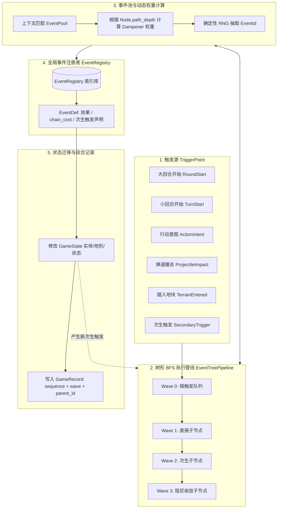

# 事件系统架构设计说明（Event System Architecture）

本文档定义《俄罗斯轮盘》的通用事件系统（Event System）架构规格。系统旨在解决局内事件单一、缺乏戏剧化表现、无法连环反应的问题，同时严格保持 Core 确定性、因果清晰与无死循环安全保证。

---

## 1. 核心设计原则

1. **绝对确定性（Deterministic Execution）**：
   所有事件抽取、偏转判定、连环反应均基于独立随机流（`state.rng.events`），系统时间、外部时钟、网络与并发不可进入 Core。相同种子与相同指令输入必须产生 100% 相同的结果。
2. **事件定义索引化（Indexed Event Definitions）**：
   不同事件池中包含大量相同的通用物理或叙事事件（如“脚底打滑”、“哑火”、“后坐力失控”、“碎裂”）。事件元数据统一以 `EventId` 注册在全局注册表中，事件池只记录 `(EventId, BaseWeight, Modifiers)`，消除逻辑与文本冗余。
3. **树形 BFS 连锁模型（Tree BFS Chain Model）**：
   事件产生次生触发（Secondary Triggers）时不采用扁平队列或 DFS，而是以**树的广度优先遍历（BFS）**逐波次展开，保持自然的因果时间层级（Wave 0: 初始动作 -> Wave 1: 直接反应 -> Wave 2: 连环扩散）。
4. **事件消耗深度（Chain Cost）与分枝独立性（Branch Independence）**：
   每个事件显式声明其连锁深度增量 `chain_cost`（高烈度事件推高链长，过渡响应事件链长为 0）。每个树节点记录其路径累积链长 `path_depth`，各分枝独立累积，互不影响。
5. **收敛阻尼机制（Event Dampening）**：
   每个事件池都配有具备收敛阻尼属性（`is_dampener = true`）的事件（无论该池是否包含“无事发生”）。随着节点 `path_depth` 增加，易扩散事件权重衰减，阻尼事件权重激增，使事件链在概率上自然软着陆收敛，避免生硬截断。

---

## 2. 总体架构拓扑



---

## 3. 树形 BFS 连锁模型规格

### 3.1 树节点定义

```rust
pub struct EventNode {
    /// 局内唯一节点序号
    pub node_id: u32,
    /// 触发源父节点 ID（根节点为 None）
    pub parent_id: Option<u32>,
    /// 所属波次（第 0 波、第 1 波、第 2 波...）
    pub wave: u32,
    /// 沿该分支自根节点累积的路径链长深度
    pub path_depth: u32,
    /// 本节点承载的触发上下文
    pub trigger: TriggerPoint,
}
```

### 3.2 波次迭代消费算法

1. 将初始触发包装为 `EventNode { node_id: 1, parent_id: None, wave: 0, path_depth: 0, trigger: root }`，加入 `Wave 0` 队列。
2. 循环处理当前波次队列：
   - 提取节点，根据 `node.trigger` 匹配事件池 `EventPool`；
   - 传入 `node.path_depth`，事件池依据阻尼算法抽取获得 `EventId`；
   - 查阅 `EventRegistry` 获取静态元数据 `EventDef`；
   - 执行 `EventDef.effect`，更新 `GameState` 并写入带 `(sequence, wave, parent_id)` 的综合记录；
   - 计算子节点链长：`child_depth = node.path_depth + def.chain_cost`；
   - 若 `child_depth < MAX_BRANCH_DEPTH`，将 `def.next_triggers` 全部打包为子节点，加入 `Wave + 1` 队列；
3. 将下一波队列设为当前波，递增 `wave`，重复步骤 2 直至队列为空或达到全局安全步数上限。

---

## 4. 事件消耗深度（Chain Cost）与收敛阻尼算法

### 4.1 事件消耗深度分级

| `chain_cost` | 定位 | 示例事件 | 效果 |
|---|---|---|---|
| **0** | 刚性过渡 / 状态标记 | 水中穿透、命中护盾破碎、暴露位置、轻微水花 | 不增加后续深度惩罚，保证复合操作完整展开 |
| **1** | 标准行动 / 普通意外 | 脚底打滑多滑一格、晕头转向反向射击、子弹卡壳 | 正常递增深度，平稳推进 |
| **2** | 中度意外 / 区域破坏 | 木箱撞碎爆裂、子弹跳弹擦伤旁人 | 加速下一波收敛 |
| **3 ~ 4** | 剧烈事件 / 高危殉爆 | 地雷连锁剧烈爆炸、暴雪天气骤变、大范围坍塌 | 强力推高后续 `path_depth`，迫使下层迅速闭环 |

### 4.2 阻尼动态权重数学模型

设当前节点累积链长为 $D = \text{node.path\_depth}$。对事件池中的每个候选项计算有效权重 $W_{\text{eff}}$：

1. **扩散型事件（`is_dampener = false`）**：
   $$W_{\text{eff}} = \max\left(1, \; \left\lfloor \frac{W_{\text{base}}}{1 + D \times k_{\text{decay}}} \right\rfloor\right)$$
   *其中 $k_{\text{decay}}$ 为衰减系数（默认 1.0）。随着链长增长，扩散事件权重显著下降。*

2. **收敛型事件（`is_dampener = true`）**：
   $$W_{\text{eff}} = W_{\text{base}} + D \times \text{dampening\_growth}$$
   *其中 $\text{dampening\_growth}$ 为增长系数（默认 20~50）。即便事件池没有“无事发生”，池内的自然闭环事件（如“弹头嵌入泥土”、“碎裂成飞灰落地”、“水波消散”）权重也会大幅激增并主导抽签。*

---

## 5. 触发时机与生命周期

### 5.1 生命周期触发点清单

- **`RoundStart`（大回合开始）**：
  - 触发时机：所有存活玩家轮完一圈，`round` 递增。
  - 主要用途：环境与天气系统判定（如暴雪骤降、热浪、酸雨）。
- **`TurnStart`（小回合开始）**：
  - 触发时机：轮到某位具体玩家前。
  - 主要用途：被动状态结算（如持续掉血、冰冻僵直判定、眩晕恢复）。
- **`ActionIntent`（行动意图）**：
  - 触发时机：玩家/Bot 提交 `Move`、`Shoot`、`Wait` 之后，实际执行之前。
  - 主要用途：失误或戏剧化偏转（如晕头转向反向射击、脚底打滑多滑一格）。
- **`TerrainEntered`（踏入地块）**：
  - 触发时机：实体坐标发生位移后进入新地块。
  - 主要用途：踩中地雷、冰面滑行、踩碎薄冰、落入深水、触发机关。
- **`ProjectileImpact`（弹道碰撞）**：
  - 触发时机：子弹飞行线路上遭遇首个障碍物或玩家。
  - 主要用途：击碎木箱、引爆地雷、跳弹反噬、击穿护盾。
- **`ChainTrigger`（次生自定义触发）**：
  - 触发时机：上一事件主动派发。
  - 主要用途：相变与连环传导（如天气暴雪触发“全图水域结冰”事件）。

---

## 6. 典型戏剧化场景推演

### 场景 A：暴雪天气与水面结冰连锁

1. **Wave 0 (RoundStart)**：Round 1 结束，进入 Round 2。派发大回合触发点。
2. **Wave 1**：环境事件池抽中 `evt_weather_blizzard`（大暴雪袭来，`chain_cost = 3`）。
   - 状态变更：`state.environment.weather = Weather::Blizzard`。
   - 派发次生触发：`ChainTrigger { tag: "freeze_waters" }`。
3. **Wave 2**：全图扫描所有 `Terrain::Water` 地块，逐一触发相变事件 `evt_water_freeze_ice`（水面冻结成冰，`chain_cost = 0`）。
   - 状态变更：水域变为 `Terrain::Ice`，产生地貌变更事实记录。
4. **后续回合**：玩家移动经过原本水域，不再执行憋气判定，而是触发冰面事件池，高概率触发滑行！

### 场景 B：晕头转向反向射击与连环意外

1. **Wave 0 (ActionIntent)**：玩家向右射击。
2. **Wave 1**：射击意图池抽中 `evt_disoriented_reverse_shot`（晕头转向向左开枪，`chain_cost = 1`）。
   - 实际指令方向改写为 `Left`，子弹飞向左侧。
3. **Wave 2**：左侧命中木箱，触发 `evt_crate_splinter_blast`（木箱爆裂碎屑四溅，`chain_cost = 2`）。
   - 木箱变为平地，派发冲击波次生触发到相邻地块。
4. **Wave 3**：相邻地块刚好潜伏着敌人，触发 `evt_player_hit_splinter`（被飞溅碎屑划伤并暴露，`chain_cost = 1`）。
5. **Wave 4**：由于累积链长已达 $1+2+1=4$，子事件池阻尼权重极高，抽中收敛事件 `evt_dust_settles`（烟尘落定，`is_dampener = true`），连锁平息闭环。

---

## 7. 领域契约规划（`roulette-domain`）

- `EventId(pub &'static str)`：强类型全局索引，如 `EventId("evt_revolver_misfire")`。
- `EventTier`：`Normal`, `Uncommon`, `Rare`, `Epic`, `Legendary`。
- `Weather`：`Clear`, `Blizzard`, `Heatwave`, `ToxicFog`。
- `Terrain::Ice`：冰面。
- `RngStreams`：新增 `events: u64` 独立随机种子。
- `GameEvent`：增加对 `event_id`、`tier`、`wave` 与 `parent_sequence` 的可选记录字段，保持序列化向后兼容。
