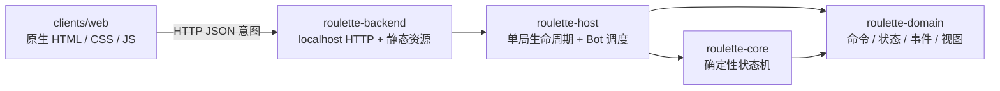

# 本地 Web MVP 架构与抽象

## 1. 目标与边界

本版本以“单机即可完成一局”为目标，但保留未来公网服务器权威架构的核心边界。浏览器和 Rust 进程通过 HTTP 交互；只有 Rust Core 能修改权威状态。

本地运行时没有数据库、文件存档、账号或跨进程消息。关闭进程后对局丢失是有意限制。

## 2. 模块职责

### `roulette-domain`

只承载可序列化、与传输方式无关的数据契约：

- `PlayerCommand`：移动、射击、等待和主动结束。
- `GameState`：完整权威状态，包括显式随机流。
- `GameEvent`：游戏世界中已经发生的结构化事实，不以播报字符串作为事实来源。
- `GameRecord`：带单调序号的统一日志信封，内容可分别是行动、事件、回合推进或系统通知。
- `GameView`：本地 Web 使用的全图视图。

Domain 不访问时间、网络、文件或随机源。

### `roulette-core`

无状态的规则入口 `GameEngine`，负责创建地图、验证回合、应用命令、推进状态、产生记录、结算胜负及投影视图。随机状态显式保存在 `GameState::rng` 中，并按地图、相遇、战斗和 Bot 决策分流，使无关随机消费不会互相改变结果。

记录不使用“一个行动对应一个结果”的模型。人类与 Bot 提交的命令都只作为 `Action` 记录；随后可以产生零到多个描述世界状态变化的 `Event`，也可能由环境或未来事件系统在没有玩家行动作为直接父项时产生事件。`Turn` 和 `Notification` 同样是并列类别。数组顺序和 `sequence` 只表达发生次序，不表达因果关系。射击行为不会再重复产生“已射击”事件；空膛、未命中、命中或地形变化才是独立事件事实。

Core 不认识浏览器、HTTP、房间或本地进程。

### `roulette-host`

`LocalMatch` 拥有一份内存状态，并提供：

- 以 revision 做乐观并发检查；
- 只允许浏览器控制固定的人类玩家；
- 人类行动后驱动随机 Bot，直到人类再次获得回合或比赛结束；
- 将所有 Bot 指令送入与人类相同的 Core 入口。

目前是单局实现。未来房间列表、身份、重连、幂等键和持久化应扩展 Host 或新增明确适配器，不进入 Core。

### `roulette-backend`

应用组合入口，使用 Axum 绑定 `127.0.0.1:8787`，持有一个 `Mutex<Option<LocalMatch>>`，并把 `clients/web` 的三个静态文件编译进可执行程序。系统时间只在此层用于生成用户未指定的种子。

### `clients/web`

零构建薄客户端。它保存最新 `GameView` 作为显示快照，并在动作时回传 `expected_revision`。操作按钮与地图共用一个面板，在空间足够时紧邻地图显示；窄屏时折到地图下方。页面把记录按 sequence 从小到大渲染为单列时间线，从上向下阅读，并在更新后滚动到最新记录。按钮状态和动画可以由页面决定，但规则结果和记录间因果不能由页面决定。

## 3. HTTP 契约

| 方法与路径 | 输入 | 输出 |
|---|---|---|
| `GET /api/health` | 无 | `{ "status": "ok" }` |
| `GET /api/game` | 无 | 当前 `GameView`；未开局为 404。 |
| `POST /api/game/new` | `player_name`、`bot_count`、可选 `seed` | 新对局的 `GameView`。 |
| `POST /api/game/command` | `expected_revision`、`command` | 人类与随后 Bot 行动完成后的 `GameView`。 |

MVP 直接使用 Rust 数据的 Serde JSON 形式，尚未冻结为公共协议。公网版接入多语言客户端前，应在 `protocol/` 中定义版本化 schema，避免客户端依赖 Rust 内部演进。

## 4. 关键不变量

- 只有当前存活玩家可以行动。
- 一个已接受命令令 revision 恰好增加一次；Host 拒绝 revision 不一致的浏览器命令。
- 相同种子和指令序列产生相同状态与事件。
- Core 的确定性路径不读取系统时间或外部随机源。
- Bot 不直接修改状态，也没有隐含特权。
- 客户端不复制命中、地形和胜负规则。
- 每条 `GameRecord` 的 sequence 在单局内严格递增；记录类别并列，不通过嵌套关系声明因果。

## 5. 向公网版演进

保留 Domain 和 Core，先将 `LocalMatch` 泛化为多房间 Host，再引入身份令牌、幂等键、重连视图、持久化端口及 WebSocket 广播。`roulette-backend` 的本地内存和静态资源职责届时可拆成适配器；这不要求改写权威规则状态机。
