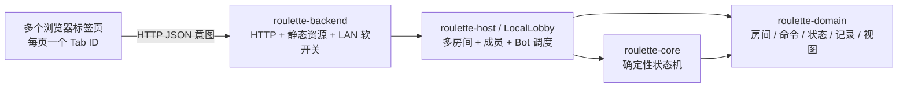

# 本地 Web MVP 架构与抽象

## 1. 目标与边界

本版本用一个本地 Rust 进程承载多张内存牌桌，用浏览器的不同标签页模拟多名真人玩家。它验证大厅、房间权限、真人/Bot 混合对局和权威规则边界，不引入账号、数据库、WebSocket 或公网安全体系。

关闭进程后房间和对局全部丢失是有意限制。浏览器只提交意图；房间权限与玩法裁定均在 Rust 端完成。

## 2. 身份、房间与活动生命周期

### Tab 身份

- 前端为每个顶层标签页生成 UUID 形式的 `TabId`，保存在该页的 `sessionStorage` 中。
- 刷新和同页导航会沿用当前 Tab ID。新标签页通常没有该存储；若浏览器复制标签页时同时复制了 `sessionStorage`，页面会通过同源 `BroadcastChannel` 发现冲突并让新页面换用新的 Tab ID。
- 同一个 Tab 同时只能加入一个房间。Tab ID 是本地会话标识，不是安全凭证。
- 页面每 2 秒拉取最新大厅或房间视图，每 5 秒发送心跳；后端在 15 秒无活动后清理该真人成员。

### 房间生命周期

- `LocalLobby` 同时持有多个 `Room`，房间使用五位大写字母/数字 ID；查找时不区分大小写。
- 新房间创建者成为房主。房间可不设密码，也可使用区分大小写的密码；成功加入后密码随 `RoomView` 对所有成员显示。
- 等候阶段允许真人加入，房主可添加/删除 Bot。总席位上限为 6，达到 3～6 名成员时房主可以开局。
- 房主可把身份转让给另一名真人。房主离开时自动把身份交给仍在房间的真人；最后一名真人离开后房间自动解散。
- 对局进行中，退出真人的比赛席位转换为 Bot 托管，避免回合永久阻塞；若已无真人则仍直接解散房间。
- 房主可在任意阶段主动解散房间。当前结束后的房间仅供查看，不支持在原房间重开。

## 3. 模块职责

### `roulette-domain`

承载可序列化、与传输方式无关的数据契约：

- `TabId`、`RoomId`、`RoomMemberId` 与 `PlayerId`；
- `LobbyView`、`RoomSummary`、`RoomView` 与成员/阶段视图；
- `PlayerCommand`、`GameState`、`GameEvent`、`GameRecord` 与 `GameView`。

Domain 不访问时间、网络、文件或随机源。

### `roulette-core`

`GameEngine` 负责创建地图、验证回合、应用命令、推进状态、产生记录、结算胜负及投影视图。随机状态显式保存在 `GameState::rng` 中，并按地图、相遇、战斗和 Bot 决策分流。

记录不使用“一个行动对应一个结果”的模型。真人与 Bot 命令是并列的 `Action`；其后可产生零到多个 `Event`，环境事件未来也可独立出现。`Turn` 和 `Notification` 同样是并列类别。数组顺序与 `sequence` 只表达先后，不表达因果。

Core 不认识 Tab、房间、HTTP 或本地进程。

### `roulette-host`

`LocalLobby` 管理多房间、成员、房主、密码和超时；每个开始的房间持有一个 `HostedMatch`。Hosted Match 负责：

- 将 `TabId` 映射到该局 `PlayerId`；
- 以 revision 做乐观并发检查；
- 只允许当前真人玩家所属标签页提交指令；
- 经同一个 Core 入口连续驱动 Bot，直到轮到真人或对局结束。

Host 不认识 HTTP、Socket 地址、环境变量或页面结构。

### `roulette-backend`

Axum 应用组合入口持有一个 `Mutex<LocalLobby>`，把 `clients/web` 三个静态文件编译进可执行程序，并使用系统时间生成默认房间码 RNG 和对局种子。

服务默认绑定 `0.0.0.0:8787`，但中间件在“局域网访问”关闭时拒绝所有非回环来源。启动参数或环境变量注入的创始人临时密码用于在本机标签页建立轻量创始人会话，认证后可实时切换局域网访问：

1. `--founder-password VALUE` 或 `--founder-password=VALUE`；
2. `ROULETTE_FOUNDER_PASSWORD`；
3. 均未提供时启动时生成八位临时密码并打印。

可用 `ROULETTE_LAN_EXPOSED=1` 改变初始开关。此设计是本地便利性软门，不可替代公网认证、TLS、防重放或权限审计。

### `clients/web`

零构建薄客户端，分为大厅、房间成员区和游戏区。操作区在宽屏紧邻地图，窄屏移到地图下方；真人与 Bot 使用同一种成员卡片。对局记录按 sequence 从小到大渲染成一列，阅读方向固定为从上到下。

## 4. HTTP 契约

所有需要识别真人的调用都携带 `tab_id`。当前直接使用 Rust Serde JSON，尚未冻结为公共协议。

| 方法与路径 | 用途 |
|---|---|
| `GET /api/health` | 服务健康检查。 |
| `GET /api/lobby?tab_id=...` | 当前房间目录及请求 Tab 所在房间。 |
| `POST /api/session/heartbeat` | 刷新 Tab 活动时间。 |
| `POST /api/rooms` | 创建房间并成为房主。 |
| `POST /api/rooms/join` | 通过房间号和可选密码加入。 |
| `GET /api/rooms/{id}?tab_id=...` | 获取成员专属房间/游戏视图。 |
| `POST /api/rooms/{id}/leave` | 离开房间。 |
| `POST /api/rooms/{id}/bots/add` | 房主添加 Bot。 |
| `POST /api/rooms/{id}/bots/remove` | 房主移除指定 Bot。 |
| `POST /api/rooms/{id}/owner` | 房主转让给指定真人。 |
| `POST /api/rooms/{id}/start` | 房主以可选种子开局。 |
| `POST /api/rooms/{id}/dissolve` | 房主解散房间。 |
| `POST /api/rooms/{id}/command` | 当前真人提交 command + expected_revision。 |
| `POST /api/founder/auth` | 当前 Tab 验证创始人临时密码。 |
| `GET/POST /api/server/settings` | 查看或由创始人修改局域网开关。 |

## 5. 关键不变量与后续演进

- 房间号长度固定为五位并使用大小写无关查找；同一进程中不会重复分配活动房间号。
- 房间始终至少有一名真人；最后真人离开或超时即解散。
- Bot 不拥有房间，也不直接修改权威状态。
- 只有房主可管理 Bot、开局、转让或解散；只有对应 Tab 可替自己的真人席位行动。
- 一个已接受命令令 revision 恰好增加一次；相同种子和指令序列产生相同状态与记录。
- 客户端不复制命中、地形、房间权限或胜负规则。

公网版可以保留 Domain 与 Core，但需要把 Tab ID 替换为正式身份/会话令牌，引入幂等键、断线重连、WebSocket 广播、数据库持久化、密码哈希和完整安全边界。本地 `LocalLobby` 是产品行为的试作，不是公网基础设施的直接实现。
