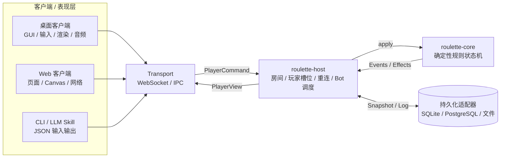
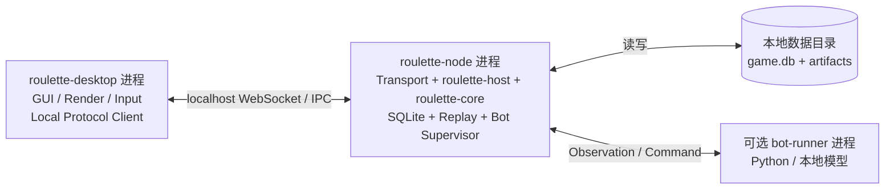
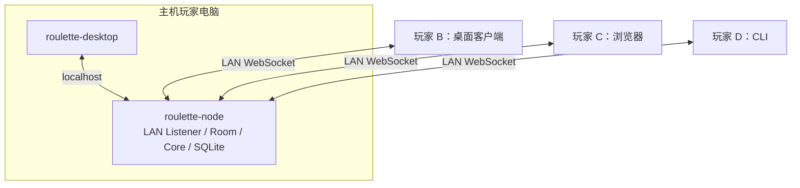
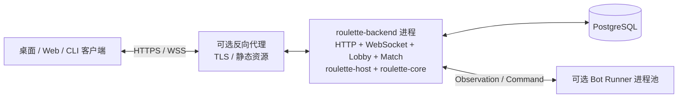
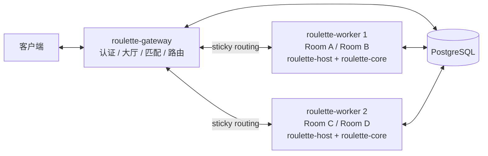
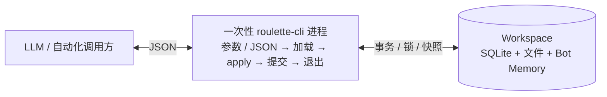
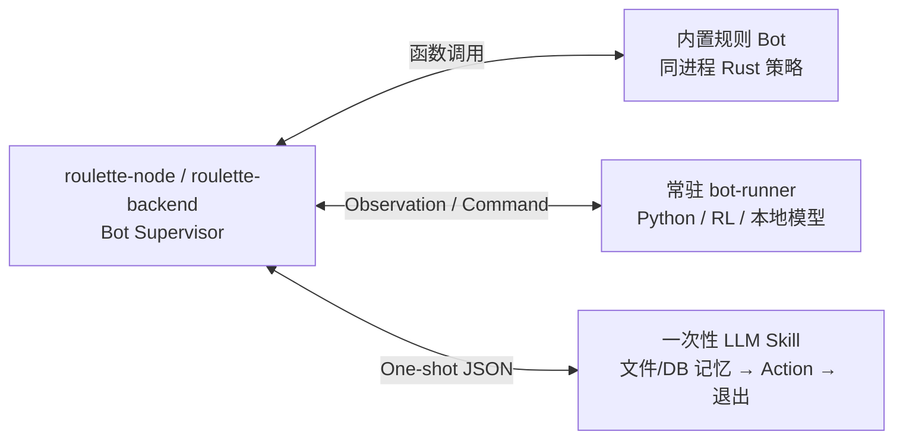
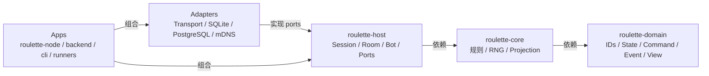
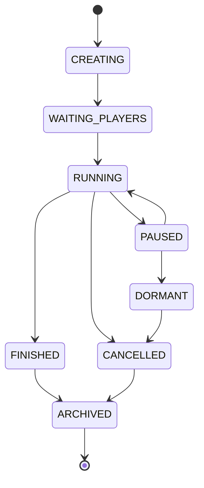

# 《俄罗斯轮盘》：架构与开发说明

> **覆盖领域：** Core / Host / Server / Client / CLI / AI Bot  
> **适用阶段：** 原型设计至首个公网版本  
> **文档状态：** 供团队评审与实施使用

## 文档控制

| **字段**   | **内容**                                                   |
|------------|------------------------------------------------------------|
| 文档名称   | 《俄罗斯轮盘》架构与开发说明                               |
| 版本       | v0.2                                                       |
| 状态       | 架构基线草案                                               |
| 目标读者   | 游戏程序、服务端、客户端、AI/Bot、测试、运维人员           |
| 覆盖范围   | 进程边界、源码模块、运行模式、协议、持久化、测试与实施顺序 |
| 不覆盖范围 | 具体玩法数值、美术管线、商业化、发行平台 SDK 的详细接入    |

### 修订记录

| **版本** | **日期**   | **变更说明**                                     | **状态** |
|----------|------------|--------------------------------------------------|----------|
| v0.1     | 2026-08-02 | 建立总体架构、各游玩模式进程拓扑和源码组织基线。 | 草案     |
| v0.2     | 2026-08-02 | 统一项目称谓，并明确 Web 公网首版开发支线。      | 草案     |

### 阅读约定

- **MUST / 必须：**实现不得违反，否则会破坏兼容性、确定性或权威状态边界。

- **SHOULD / 应当：**默认应遵守；偏离时必须记录架构决策及原因。

- **MAY / 可以：**可按团队、玩法和性能条件选用。

- **进程：**操作系统中独立运行的程序实例；不等同于源码模块。

- **可执行文件：**可被启动的程序，例如 roulette-node；一个可执行文件可组合多个源码库。

- **源码模块：**可复用的库或 crate，例如 roulette-core；可被编译进多个可执行文件。

### 章节目录

1. 文档目的与系统目标
2. 术语和总体原则
3. 逻辑架构与职责边界
4. 可执行程序与进程职责
5. 各游玩模式进程规范
6. Core 设计契约
7. 源码组织与依赖规则
8. 网络协议与跨客户端规范
9. 持久化与无状态 CLI
10. AI Bot 架构
11. 生命周期、故障与安全
12. 测试规范
13. 实施阶段与交付标准
14. 架构决策摘要
15. 附录：启动示例、检查清单与推荐运行组合

## 1 文档目的与系统目标

本说明用于统一《俄罗斯轮盘》在单机、局域网、公网、CLI/LLM 与本地 AI 场景下的架构边界。文档重点规定“哪些职责属于哪个源码模块”“不同运行模式会启动哪些进程”“权威状态和持久化位于何处”，作为后续编码、测试和部署的共同基线。

### 1.1 产品目标

- 同一套游戏规则 Core 能够作为库复用，也能够通过独立进程包装供其他语言或工具调用。

- 支持公网服务器联机、局域网玩家主机和局域网专用服务器。

- 支持桌面 GUI、Web、交互式 CLI 和面向 LLM Skill 的一次性无状态 CLI。

- 不同客户端可以加入同一局游戏，并遵循同一套权威规则。

- 支持完全本地的规则 Bot、Python Bot 和本地模型/LLM Bot。

- 相同规则版本、种子和命令序列能够产生可重放、可验证的相同结果。

### 1.2 架构假设

| **项目**   | **当前基线假设**                                         |
|------------|----------------------------------------------------------|
| 房间规模   | 一局通常为 1–8 名玩家与 Bot，按房间隔离。               |
| 玩法节奏   | 回合制、半实时或中低频实时；不是百人同屏强同步动作游戏。 |
| 服务器模型 | 服务器权威；客户端提交意图而非直接修改状态。             |
| 扩展单位   | 扩展和迁移的基本单位是一局 Match，而不是单个 HTTP 请求。 |
| 存档模式   | 快照 + 命令/事件增量日志。                               |
| 首版部署   | 模块化单体优先，达到真实瓶颈后再拆 Gateway 与 Worker。   |


> [!IMPORTANT]
> **核心决策**
>
> “Core 可作为独立进程”不等于“联机服务器必须通过 RPC 调用独立 Core”。正常服务器和本地节点应将 Core 作为库内嵌；独立 Core Runner 只作为工具、沙箱或跨语言适配方式。


## 2 术语和总体原则

### 2.1 术语

| **术语**        | **定义**                                                     |
|-----------------|--------------------------------------------------------------|
| GameState       | 一局游戏的完整权威状态，包含不可向普通客户端公开的信息。     |
| PlayerView      | 从 GameState 按观察者身份投影出的可见状态。                  |
| PlayerCommand   | 客户端或 Bot 提交的游戏意图，例如移动、攻击、选择奖励。      |
| Domain Event    | 规则层确认已经发生的事实，例如 DamageApplied。               |
| Effect Request  | Core 请求 Host 执行的外部效果，例如保存、广播、启动 Bot。    |
| Match / Session | 一局游戏会话，是状态隔离、命令串行和故障恢复的基本单位。     |
| Host            | 管理一局或多局会话的通用逻辑层，不等同于某个具体网络服务器。 |
| Node            | 面向本地、局域网或私人专服的承载进程。                       |
| Backend         | 包含公网认证、大厅、匹配和游戏会话的首版公网服务进程。       |
| Revision        | 权威状态的单调递增版本号，用于并发检查、重试和重同步。       |

### 2.2 总体设计原则

> **1.** 服务器权威：客户端和 Bot 只能提交命令，不能直接提交最终状态。
>
> **2.** 确定性 Core：规则层不得读取网络、数据库、文件、系统时钟或隐式全局随机数。
>
> **3.** 单局串行写入：同一 Match 的命令必须通过一个有序队列执行。
>
> **4.** 协议与领域模型分离：网络 DTO、数据库记录和 GameState 不得被视为同一种结构。
>
> **5.** 本地与公网复用：单机、LAN 与公网使用相同的 Host 和 Core，仅替换接入与存储适配器。
>
> **6.** 进程无状态不等于业务无状态：一次性 CLI 的连续性来自文件和数据库。
>
> **7.** Bot 普通玩家化：Bot 获取 PlayerView，提交 PlayerCommand，并受相同规则校验。
>
> **8.** 模块化单体优先：没有量化瓶颈前，不拆分大量微服务。

## 3 逻辑架构与职责边界



**图 1：逻辑层次与数据流**

| **层次**        | **负责**                                                 | **明确不负责**                               |
|-----------------|----------------------------------------------------------|----------------------------------------------|
| 表现层 / Client | 输入、GUI、动画、音频、连接、缓存、重连、PlayerView 展示 | 权威战斗、隐藏信息、最终随机结果、服务端存档 |
| 会话层 / Host   | 房间、玩家槽位、命令队列、重连、Bot 调度、持久化编排     | 具体伤害公式、地图规则、平台 UI              |
| 规则层 / Core   | 命令校验、状态转移、RNG、事件、PlayerView 投影           | 网络、SQL、文件、系统时间、进程管理          |
| 适配器层        | WebSocket、IPC、SQLite、PostgreSQL、mDNS、文件系统       | 定义玩法规则                                 |
| 应用组合层      | 选择模块、读取配置、启动服务、处理操作系统信号           | 复制一套规则实现                             |


> [!IMPORTANT]
> **权威调用链**
>
> `Client/Bot → PlayerCommand → Host 命令队列 → Core.apply → Events/Effects → Host 保存并广播 PlayerView`。任何绕过该链路直接修改 `GameState` 的实现均不合规。


## 4 可执行程序与进程职责

| **可执行程序**   | **典型生命周期** | **组合的主要源码模块**                                         | **用途**                         |
|------------------|------------------|----------------------------------------------------------------|----------------------------------|
| roulette-desktop     | 长期             | 客户端协议 SDK、GUI/渲染；Tauri 路线可选内嵌 Host/Core         | 桌面玩家客户端                   |
| roulette-node        | 长期             | Transport + roulette-host + roulette-core + SQLite + Bot Supervisor    | 单机子进程、LAN 主机、私人专服   |
| roulette-backend     | 长期             | HTTP/WSS + 认证/大厅/匹配 + roulette-host + roulette-core + PostgreSQL | 首版公网服务                     |
| roulette-gateway     | 长期             | 认证、大厅、匹配、连接路由                                     | 公网扩容后的控制面               |
| roulette-worker      | 长期             | 房间承载 + roulette-host + roulette-core + PostgreSQL Adapter          | 公网扩容后的游戏工作进程         |
| roulette-cli         | 一次性或交互式   | CLI Adapter + 远程协议，离线时还包含 Host/Core/SQLite          | 人工 CLI、脚本、LLM Skill        |
| roulette-bot-runner  | 长期或按需       | Bot SDK、模型调用、资源限制                                    | Python、RL、本地模型与不可信 Bot |
| roulette-core-runner | 一次性或工具常驻 | JSON/IPC 包装 + roulette-core                                      | 跨语言、沙箱、回放对比、模糊测试 |


> [!NOTE]
> **进程与源码的关系**
>
> 同一个 `roulette-core` 源码会被编译进 `roulette-node`、`roulette-backend`、`roulette-cli` 和 `roulette-core-runner`。它们共享源码与行为，但运行时拥有彼此独立的内存。


## 5 各游玩模式进程规范

本章按实际启动方式列出进程拓扑。除特别说明外，所有多人模式均为服务器权威，客户端只持有 PlayerView 与表现状态。

### 5.1 纯内嵌单机（可选）

**运行时进程拓扑**

| **进程**        | **包含的职责**                                                             | **备注**      |
|-----------------|----------------------------------------------------------------------------|---------------|
| roulette-desktop    | GUI、输入、渲染、音频；同进程内嵌 roulette-host、roulette-core 和 SQLite Adapter。 | 仅 1 个主进程 |
| roulette-bot-runner | 仅外部 Python 或模型 Bot 需要。                                            | 0–`N` 个       |

| **项目**     | **规定**                                                            |
|--------------|---------------------------------------------------------------------|
| 权威状态位置 | roulette-desktop 进程内的 GameState。                                   |
| 持久化位置   | 本地 SQLite 与 artifacts 目录。                                     |
| 启动流程     | 启动桌面程序后直接创建内嵌 Host。                                   |
| 退出流程     | Host 保存并 checkpoint，随后退出 GUI。                              |
| 故障边界     | GUI 崩溃可能同时终止会话；FFI 与游戏引擎崩溃边界较弱。              |
| 采用建议     | 适合早期原型、Tauri 或纯单机试玩；不作为 Godot 桌面的默认生产方案。 |

### 5.2 推荐单机：独立本地节点



**图 2：推荐单机进程分布**

| **进程**        | **包含的职责**                                                                       | **备注**       |
|-----------------|--------------------------------------------------------------------------------------|----------------|
| roulette-desktop    | GUI、渲染、输入、音频和 Local Protocol Client。                                      | 不包含权威规则 |
| roulette-node       | 本机 Transport、Room/Session、roulette-host、roulette-core、SQLite、Replay、Bot Supervisor。 | 权威进程       |
| roulette-bot-runner | 可选的外部 Bot。                                                                     | 0–`N` 个        |

| **项目**     | **规定**                                                                                  |
|--------------|-------------------------------------------------------------------------------------------|
| 权威状态位置 | roulette-node 进程内的 Match。                                                                |
| 持久化位置   | roulette-node 管理的 SQLite 与文件目录。                                                      |
| 启动流程     | roulette-desktop 启动 roulette-node 子进程，等待健康检查后通过 localhost WebSocket/IPC 创建房间。 |
| 退出流程     | 客户端请求保存与关闭；roulette-node 完成 checkpoint 后退出。                                  |
| 故障边界     | GUI 与游戏会话隔离；节点异常时可以依据最后快照恢复。                                      |
| 采用建议     | 桌面版默认模式；与 LAN 和公网客户端协议最接近。                                           |

### 5.3 同机多客户端与测试模式

**运行时进程拓扑**


```text
roulette-desktop ──┐
roulette-cli ───────┼── localhost ── roulette-node
测试客户端 ─────┘                    └── 可选 bot-runner
```


| **进程**                 | **包含的职责**                       | **备注** |
|--------------------------|--------------------------------------|----------|
| roulette-node                | 承载唯一权威 Match，并监听本机连接。 | 1 个     |
| roulette-desktop / Web / CLI | 分别作为普通协议客户端加入同一局。   | `N` 个     |
| roulette-bot-runner          | 通过 Bot 协议加入玩家槽位。          | 0–`N` 个  |

| **项目**     | **规定**                                                       |
|--------------|----------------------------------------------------------------|
| 权威状态位置 | roulette-node。                                                    |
| 持久化位置   | roulette-node 的 SQLite。                                          |
| 启动流程     | 先启动 roulette-node，再启动任意客户端并使用同一房间标识加入。     |
| 退出流程     | 最后一个客户端离开后按房间策略暂停、保存或终止。               |
| 故障边界     | 单个客户端崩溃不影响 Match；roulette-node 崩溃影响所有同机参与者。 |
| 采用建议     | 用于跨客户端联调、自动化测试、CLI 与 GUI 互操作验证。          |

### 5.4 局域网玩家主机



**图 3：局域网玩家主机进程分布**

| **进程**          | **包含的职责**                                          | **备注**            |
|-------------------|---------------------------------------------------------|---------------------|
| 主机 roulette-desktop | 主机玩家的表现层。                                      | 通过 localhost 连接 |
| 主机 roulette-node    | LAN WebSocket Listener、mDNS、房间、Core、SQLite、Bot。 | 唯一权威节点        |
| 其他客户端        | 桌面、Web 或 CLI，使用局域网地址连接。                  | 跨设备              |
| roulette-bot-runner   | 可运行在主机机器上。                                    | 可选                |

| **项目**     | **规定**                                                               |
|--------------|------------------------------------------------------------------------|
| 权威状态位置 | 主机电脑的 roulette-node。                                                 |
| 持久化位置   | 主机电脑上的 SQLite 与 artifacts。                                     |
| 启动流程     | 主机客户端启动 roulette-node；节点发布 mDNS/邀请码；其他客户端发现并加入。 |
| 退出流程     | 主机退出前保存并通知客户端；房主迁移不作为首版必需能力。               |
| 故障边界     | 主机掉电将中断整局；客户端掉线可通过 actor token 重连。                |
| 采用建议     | 局域网默认的人开房模式；发现机制仅负责找地址，不创建第二套游戏协议。   |

### 5.5 局域网专用服务器

**运行时进程拓扑**


```text
服务器机器：roulette-node --headless + SQLite
客户端机器：Desktop / Web / CLI ── LAN WebSocket ── roulette-node
```


| **进程**  | **包含的职责**                                                       | **备注**   |
|-----------|----------------------------------------------------------------------|------------|
| roulette-node | 无界面运行，承载多个房间、LAN 发现、Core、SQLite 和 Bot Supervisor。 | 服务端机器 |
| 客户端    | 仅表现与连接。                                                       | 任意系统   |

| **项目**     | **规定**                                                           |
|--------------|--------------------------------------------------------------------|
| 权威状态位置 | 专用服务器的 roulette-node。                                           |
| 持久化位置   | 服务器数据目录中的 SQLite。                                        |
| 启动流程     | 由命令行、系统服务或容器启动 roulette-node --headless。                |
| 退出流程     | 接收终止信号后停止接收新命令、保存所有房间并退出。                 |
| 故障边界     | 客户端机器故障不会终止房间；服务器故障影响其承载的全部 Match。     |
| 采用建议     | 适合 NAS、小主机、工作室内网服务器；与玩家主机复用同一可执行文件。 |

### 5.6 公网首版：模块化单体



**图 4：公网首版进程分布**

| **进程**     | **包含的职责**                                                            | **备注**       |
|--------------|---------------------------------------------------------------------------|----------------|
| 反向代理     | TLS 终止、静态资源、基础限流；可选。                                      | Caddy/Nginx 等 |
| roulette-backend | HTTP API、认证、大厅、匹配、WebSocket、Room、Host、Core、Bot Supervisor。 | 主要应用进程   |
| PostgreSQL   | 用户、房间元数据、快照、命令/事件、统计。                                 | 独立数据库进程 |
| Bot Runner   | 外部模型或 Python Bot。                                                   | 可选进程池     |

| **项目**     | **规定**                                                 |
|--------------|----------------------------------------------------------|
| 权威状态位置 | roulette-backend 内各 Match。                                |
| 持久化位置   | PostgreSQL；大型回放可放对象存储。                       |
| 启动流程     | 先启动数据库，再启动 backend；backend 注册版本和内容包。 |
| 退出流程     | 停止接入新房间，等待或保存活跃 Match，再关闭数据库连接。 |
| 故障边界     | backend 故障会影响其全部房间；依靠快照与日志恢复。       |
| 采用建议     | 首个公网版本的推荐结构，不应提前拆成多个业务微服务。     |

### 5.7 公网扩容：Gateway + Match Worker



**图 5：公网扩容后的进程分布**

| **进程**        | **包含的职责**                                  | **备注**     |
|-----------------|-------------------------------------------------|--------------|
| roulette-gateway    | 认证、大厅、匹配、Worker 选择、连接路由。       | 控制面       |
| roulette-worker     | 承载若干 Match；内部含 Host、Core、存储适配器。 | 水平扩展     |
| PostgreSQL      | 持久化、Worker 分配与恢复元数据。               | 共享基础设施 |
| Bot Runner Pool | 按 Worker 或集群调度。                          | 可选         |

| **项目**     | **规定**                                                             |
|--------------|----------------------------------------------------------------------|
| 权威状态位置 | 每局固定分配到一个 Worker；局内仅该 Worker 写入。                    |
| 持久化位置   | PostgreSQL + 可选对象存储。                                          |
| 启动流程     | Gateway 发现健康 Worker；创建房间时分配并保持粘性路由。              |
| 退出流程     | Worker 排空房间后退出；异常退出时由恢复流程重建 Match。              |
| 故障边界     | 一个 Worker 故障只影响其承载房间；Gateway 应避免保存完整 GameState。 |
| 采用建议     | 仅在单体后端出现明确 CPU、内存、发布或隔离瓶颈后采用。               |

### 5.8 离线 CLI / LLM Skill



**图 6：无状态 CLI 的一次调用**

| **进程**  | **包含的职责**                                                                     | **备注**             |
|-----------|------------------------------------------------------------------------------------|----------------------|
| 调用方    | LLM、脚本或人工命令行。                                                            | 无权威内存           |
| roulette-cli  | 一次性启动；解析 JSON、加锁、加载快照、调用 Host/Core、提交事务、输出 JSON、退出。 | 每调用一次一个新进程 |
| Workspace | SQLite、manifest、artifacts、Bot memory。                                          | 连续状态来源         |

| **项目**     | **规定**                                                                  |
|--------------|---------------------------------------------------------------------------|
| 权威状态位置 | 当前 CLI 调用内临时恢复出的 GameState；提交后以数据库为准。               |
| 持久化位置   | Workspace 内的 SQLite 与文件。                                            |
| 启动流程     | 每次调用都从命令行参数和工作目录获取全部上下文。                          |
| 退出流程     | 事务提交并输出 JSON 后立即退出，不保留进程内记忆。                        |
| 故障边界     | 崩溃前未提交的事务回滚；幂等键避免重试导致重复动作。                      |
| 采用建议     | LLM Skill 的默认离线模式；必须实现 expected_revision 与 idempotency_key。 |

### 5.9 在线 CLI / LLM Skill

**运行时进程拓扑**


```text
LLM → 一次性 roulette-cli → HTTPS/WSS → roulette-backend / roulette-node

本地仅保存：token、session、revision、LLM memory
```


| **进程**                 | **包含的职责**                                                                      | **备注**             |
|--------------------------|-------------------------------------------------------------------------------------|----------------------|
| roulette-cli                 | 读取本地连接元数据，获取 PlayerView，提交单个 PlayerCommand，写回 revision 后退出。 | 非权威               |
| roulette-backend / roulette-node | 承载 Match 与完整 GameState。                                                       | 权威                 |
| 本地 client-state.db     | 凭证引用、会话 ID、最后 revision、LLM 记忆。                                        | 不保存完整服务端状态 |

| **项目**     | **规定**                                                    |
|--------------|-------------------------------------------------------------|
| 权威状态位置 | 远端服务器。                                                |
| 持久化位置   | 服务端数据库；本地仅保存客户端和 LLM 记忆。                 |
| 启动流程     | CLI 从 connection.json/client-state.db 恢复会话并发起请求。 |
| 退出流程     | 收到结果后持久化最新 revision 并退出。                      |
| 故障边界     | 请求超时后必须使用同一幂等键重试；不可假定超时代表未执行。  |
| 采用建议     | 让 LLM 参与公网或 LAN 房间时采用。                          |

### 5.10 完全本地 AI 玩家



**图 7：本地 AI 的三种执行方式**

| **进程**         | **包含的职责**                                                  | **备注**       |
|------------------|-----------------------------------------------------------------|----------------|
| 内置规则 Bot     | Rust 策略与 roulette-node 同进程运行。                              | 性能最好       |
| 常驻 bot-runner  | Python、强化学习、本地模型；通过 Observation/Command 协议通信。 | 隔离与扩展性好 |
| 一次性 LLM Skill | 每次行动启动，记忆来自 DB/文件，输出动作后退出。                | 严格无状态进程 |

| **项目**     | **规定**                                                                     |
|--------------|------------------------------------------------------------------------------|
| 权威状态位置 | 始终位于 roulette-node 或 roulette-backend；Bot 从不拥有权威状态。                   |
| 持久化位置   | 游戏状态由节点保存；Bot 私有记忆按 Bot ID 分目录或分表保存。                 |
| 启动流程     | Host 为 Bot 分配玩家槽位，并按策略启动对应执行方式。                         |
| 退出流程     | 节点终止 Bot、保存记忆；外部 Bot 超时或退出时执行默认动作或托管。            |
| 故障边界     | Bot 进程故障不得破坏 Match；不可信 Bot 必须限制 CPU、内存和文件权限。        |
| 采用建议     | 内置 Bot 用于发行和测试；Python/模型 Bot 用于实验；LLM Bot 用于 Skill 场景。 |

### 5.11 跨客户端联机不变量

**运行时进程拓扑**


```text
Windows Desktop ─┐
Browser Web ──────┼── 同一 roulette-node / roulette-backend ── roulette-core
Linux CLI ────────┤
Bot Runner ───────┘
```


| **进程**   | **包含的职责**                                                   | **备注**       |
|------------|------------------------------------------------------------------|----------------|
| 所有客户端 | 使用共同协议语义：ActorId、PlayerCommand、PlayerView、Revision。 | 表现能力可不同 |
| 服务器     | 不得按客户端类型改变规则结果。                                   | 同一权威 Core  |
| Projection | 可按观察者身份和客户端能力裁剪表现数据。                         | 不改变规则事实 |

| **项目**     | **规定**                                                           |
|--------------|--------------------------------------------------------------------|
| 权威状态位置 | 服务器。                                                           |
| 持久化位置   | 服务器存储。                                                       |
| 启动流程     | 握手协商协议版本、规则版本和内容哈希。                             |
| 退出流程     | 客户端离开只释放连接；Actor 是否退出由房间规则决定。               |
| 故障边界     | 单个客户端未知字段或表现资源缺失不得破坏服务端 Match。             |
| 采用建议     | 客户端差异只能位于输入、UI、资源和投影层，不得复制或分叉权威规则。 |

## 6 Core 设计契约

roulette-core 是整个系统最稳定、最严格的模块。其输出必须只由显式输入决定，从而支持重放、跨平台验证、服务器恢复和 CLI 一次性调用。

### 6.1 标准接口


```rust
pub trait GameEngine {
    fn create_game(
        &self,
        config: CreateGameConfig,
    ) -> Result<GameState, GameError>;

    fn apply_command(
        &self,
        state: &GameState,
        command: PlayerCommand,
        context: CommandContext,
    ) -> Result<Transition, GameError>;

    fn project_view(
        &self,
        state: &GameState,
        viewer: ViewerId,
    ) -> PlayerView;
}

pub struct Transition {
    pub next_state: GameState,
    pub events: Vec<GameEvent>,
    pub effects: Vec<EffectRequest>,
}
```


### 6.2 必须满足的约束

| **编号** | **规范**                                                                 |
|----------|--------------------------------------------------------------------------|
| CORE-01  | Core MUST 不访问 Socket、HTTP、SQL、文件系统或系统进程。                 |
| CORE-02  | Core MUST 不直接读取系统当前时间；时间通过逻辑 tick 或显式上下文传入。   |
| CORE-03  | 随机性 MUST 来自可序列化、可重放的显式 RNG 状态或输入。                  |
| CORE-04  | 相同版本、状态、命令和上下文 MUST 产生相同 Transition 与 state_hash。    |
| CORE-05  | Core MUST 不依赖 Tokio、GUI、数据库实体或用户账号 SDK。                  |
| CORE-06  | 客户端可见信息 MUST 通过 project_view 生成，不得直接发送完整 GameState。 |
| CORE-07  | 规则失败 MUST 返回结构化 GameError，不得以进程退出表达普通非法命令。     |
| CORE-08  | 遍历顺序影响结果时 MUST 使用稳定排序，不得依赖无序容器迭代顺序。         |

### 6.3 RNG 分流


```text
game_seed
├── map_stream
├── encounter_stream
├── loot_stream
├── combat_stream
└── bot_stream
```


各随机流应通过稳定标签从 game_seed 派生。修改掉落算法时不应无意改变地图或敌人生成序列。每次命令执行后应记录 revision、规则版本和 state_hash。

### 6.4 独立 Core Runner

| **项目**       | **规范**                                                                    |
|----------------|-----------------------------------------------------------------------------|
| 输入           | StateSnapshot + PlayerCommand + CommandContext。                            |
| 输出           | NextState + GameEvents + EffectRequests + StateHash。                       |
| 允许职责       | 跨语言适配、沙箱、回放验证、版本对比、模糊测试。                            |
| 禁止职责       | 直接管理玩家连接、房间、数据库或公网认证。                                  |
| 正常服务器调用 | roulette-node/roulette-backend 应直接链接 roulette-core，不应对每个动作 RPC 到 Runner。 |

## 7 源码组织与依赖规则



**图 8：源码依赖方向**

### 7.1 依赖方向


> [!WARNING]
> **强制依赖规则**
>
> 依赖只能由应用与适配器指向 Host、Core 和 Domain。`roulette-core` 不得反向依赖 `roulette-host`、网络、数据库或任何客户端工程。


| **模块**      | **内容**                                                     | **允许依赖**                 |
|---------------|--------------------------------------------------------------|------------------------------|
| roulette-domain   | ID、State、Command、Event、View、Error 等稳定类型。          | 基础标准库和极少量纯数据依赖 |
| roulette-core     | 战斗、地图、物品、角色、RNG、校验、投影。                    | roulette-domain                  |
| roulette-host     | Session、Room、玩家槽位、命令队列、重连、Bot、持久化 Ports。 | roulette-core、roulette-domain       |
| roulette-protocol | Protobuf schema 与 DTO 转换。                                | roulette-domain 的受控映射       |
| Adapters      | WebSocket、IPC、mDNS、SQLite、PostgreSQL、文件。             | 对应 Port 与协议模块         |
| Apps          | 读取配置、组合模块、启动进程、信号处理。                     | Host、Core、Adapters         |
| Clients/SDK   | 各端协议客户端、UI、渲染、Bot SDK。                          | 生成的协议类型与客户端公共库 |

### 7.2 推荐仓库结构


```text
RussianRoulette/
├── Cargo.toml
├── crates/
│   ├── roulette-domain/
│   ├── roulette-core/
│   ├── roulette-host/
│   ├── roulette-protocol/
│   ├── roulette-transport-websocket/
│   ├── roulette-transport-local/
│   ├── roulette-discovery-mdns/
│   ├── roulette-storage-sqlite/
│   ├── roulette-storage-postgres/
│   ├── roulette-storage-files/
│   ├── roulette-bot-api/
│   ├── roulette-replay/
│   └── roulette-content/
├── apps/
│   ├── roulette-node/
│   ├── roulette-backend/
│   ├── roulette-gateway/
│   ├── roulette-worker/
│   ├── roulette-cli/
│   ├── roulette-core-runner/
│   └── roulette-bot-runner/
├── clients/
│   ├── web/
│   ├── desktop-godot/
│   └── desktop-tauri/
├── sdk/
│   ├── typescript-client/
│   ├── python-client/
│   ├── python-bot/
│   └── rust-bot/
├── content/
├── database/
└── tests/
```


### 7.3 源码模块与进程映射

| **源码模块**       | **Desktop 内嵌** | **roulette-node** | **roulette-backend/worker** | **离线 CLI** | **Bot Runner** |
|--------------------|------------------|---------------|-------------------------|--------------|----------------|
| roulette-domain        | 是               | 是            | 是                      | 是           | 部分           |
| roulette-core          | 可选             | 是            | 是                      | 是           | 否             |
| roulette-host          | 可选             | 是            | 是                      | 单步执行     | 否             |
| roulette-protocol      | 客户端侧         | 是            | 是                      | 远程模式     | 是             |
| SQLite Adapter     | 可选             | 是            | 否                      | 是           | 记忆可用       |
| PostgreSQL Adapter | 否               | 否            | 是                      | 否           | 否             |
| Bot Supervisor     | 可选             | 是            | 是                      | 否           | 否             |
| GUI/Renderer       | 是               | 否            | 否                      | 否           | 否             |

## 8 网络协议与跨客户端规范

### 8.1 Transport 基线

| **场景**             | **首版建议**              | **说明**                                      |
|----------------------|---------------------------|-----------------------------------------------|
| 登录、建房、房间列表 | HTTPS REST                | 低频请求，易于调试和缓存。                    |
| 游戏会话             | WebSocket                 | 浏览器、桌面和 CLI 均可接入。                 |
| 局域网发现           | mDNS 或 UDP Broadcast     | 仅发现地址，连接后仍使用统一 WebSocket。      |
| 本机连接             | localhost WebSocket       | 首版跨平台最简单；后续可替换 Named Pipe/UDS。 |
| 高频实时扩展         | WebTransport/QUIC（后续） | 仅在量化证明 WebSocket 不足时增加适配器。     |

### 8.2 消息信封


```protobuf
message ClientEnvelope {
  uint64 protocol_version = 1;
  string request_id = 2;
  string session_id = 3;
  uint64 expected_revision = 4;
  string idempotency_key = 5;

  oneof payload {
    JoinGame join_game = 10;
    PlayerCommand command = 11;
    Ack ack = 12;
    ResyncRequest resync = 13;
  }
}
```


| **字段**          | **用途**                             |
|-------------------|--------------------------------------|
| protocol_version  | 协议兼容协商。                       |
| engine_version    | Core 行为版本。                      |
| ruleset_version   | 玩法规则与内容逻辑版本。             |
| content_hash      | 资源与数据包锁定。                   |
| request_id        | 请求追踪。                           |
| idempotency_key   | 重复请求返回同一结果，避免重复执行。 |
| expected_revision | 乐观并发检查；过旧则要求重同步。     |
| server_sequence   | 客户端检测消息缺失或乱序。           |
| state/view_hash   | 重放与同步验证。                     |

### 8.3 跨客户端规则

- 所有客户端 MUST 使用相同语义的命令和状态投影，不得拥有客户端专属规则结果。

- 服务端 MAY 根据客户端能力省略动画提示或高精资源信息，但不得改变 Domain Event。

- 未知 Protobuf 字段应被忽略或保留；已发布字段号不得复用。

- 删除字段后应标记 reserved；枚举必须定义未知值处理。

- 握手失败必须返回明确错误，例如 UPGRADE_REQUIRED、CONTENT_MISMATCH。

## 9 持久化与无状态 CLI

### 9.1 存档模型


```text
Snapshot(revision = 100)
    + Command 101 / Events 101.x
    + Command 102 / Events 102.x
    + ...
    = Current GameState
```


| **数据**         | **用途**                                     | **建议保留**       |
|------------------|----------------------------------------------|--------------------|
| Snapshot         | 快速恢复完整 GameState。                     | 周期性、多关键节点 |
| Command Log      | 重放玩家意图、审计和幂等。                   | 至少保留当前局     |
| Domain Event Log | 回放、UI、统计和诊断。                       | 按产品需求归档     |
| State Hash       | 确定性和损坏检测。                           | 每命令或关键节点   |
| Manifest         | 规则、协议、内容和存档版本。                 | 与存档永久绑定     |
| Artifacts        | 回放、调试地图、Bot 摘要等大型或非结构数据。 | 文件/对象存储      |

### 9.2 本地 Workspace


```text
runs/run-123/
├── manifest.json
├── game.db
├── artifacts/
│   ├── replay.bin
│   ├── debug-map.json
│   └── exports/
├── bot-memory/
│   └── bot-001/
└── locks/
```


### 9.3 CLI 单次调用事务

> **1.** 打开 Workspace 与 SQLite。
>
> **2.** 开始事务并取得写锁。
>
> **3.** 检查 idempotency_key；若已执行则返回原结果。
>
> **4.** 校验 expected_revision。
>
> **5.** 读取最近快照并重放增量记录。
>
> **6.** 调用 roulette-core.apply_command。
>
> **7.** 追加命令、事件与 state_hash。
>
> **8.** 达到条件时创建新快照。
>
> **9.** 更新 revision 并提交事务。
>
> **10.** 向 stdout 输出单个 JSON 对象，诊断信息写 stderr，然后退出。


> [!WARNING]
> **SQLite 导出要求**
>
> 数据库处于 WAL 模式并正在运行时，不得只复制 `game.db`。导出必须在停止写入后执行 checkpoint，或使用 SQLite Backup API，并连同 `manifest` 与 `artifacts` 一并打包。


## 10 AI Bot 架构

### 10.1 Bot 统一接口


```json
{
  "request": {
    "request_id": "...",
    "game_id": "...",
    "actor_id": "...",
    "revision": 185,
    "observation": {},
    "legal_actions": [],
    "deadline": "..."
  },
  "response": {
    "request_id": "...",
    "revision": 185,
    "action": {},
    "memory_update": {}
  }
}
```


| **方式**       | **进程分布**               | **适用场景**                     | **限制**                           |
|----------------|----------------------------|----------------------------------|------------------------------------|
| 内置 Rust Bot  | 与 roulette-node 同进程        | 发行版默认 AI、测试 Bot          | 必须限制计算预算，不得阻塞房间循环 |
| 常驻外部 Bot   | 每个 Bot 或 Bot 池独立进程 | Python、RL、本地模型、自定义 Bot | 必须有超时、重启和资源限制         |
| 一次性 LLM Bot | 每次行动启动一个调用进程   | 无状态 Skill、离线模型           | 记忆必须落入文件/数据库            |

- Bot MUST 只能读取其 PlayerView 和 legal_actions。

- Bot MUST 提交普通 PlayerCommand，并经过与人类玩家相同的服务器校验。

- Bot 超时、崩溃或返回非法动作时，Host MUST 使用配置的托管策略。

- 不可信 Bot SHOULD 在受限用户、容器或沙箱中运行。

- Bot 私有记忆不得写入权威 GameState，除非玩法明确将其定义为游戏内容。

## 11 生命周期、故障与安全

### 11.1 Match 生命周期





| **状态**        | **允许行为**                            |
|-----------------|-----------------------------------------|
| CREATING        | 锁定规则版本、生成 seed、创建初始快照。 |
| WAITING_PLAYERS | 加入、离开、准备、Bot 填充。            |
| RUNNING         | 接收并串行执行 PlayerCommand。          |
| PAUSED/DORMANT  | 无活跃连接时保存并释放非必要内存。      |
| FINISHED        | 拒绝玩法命令，生成结算和最终回放。      |
| ARCHIVED        | 只读访问与长期存储。                    |

### 11.2 命令处理与重试

| **情况**               | **处理**                                                |
|------------------------|---------------------------------------------------------|
| 重复 idempotency_key   | 不重复执行，返回首次提交的结果。                        |
| expected_revision 过旧 | 拒绝命令并返回当前 revision 或 ResyncRequired。         |
| 请求超时               | 客户端以同一幂等键重试，不得创建新键。                  |
| 连接重建               | 使用 actor token 恢复身份，再获取 PlayerView Snapshot。 |
| Bot 超时               | 执行默认动作、跳过或启用托管 Bot，具体由房间规则决定。  |

### 11.3 安全边界

- 客户端输入 MUST 在协议层校验大小，在 Host/Core 层校验权限和规则。

- 公网连接 MUST 使用 TLS；Token 不得写入普通日志。

- 房间命令队列 MUST 有上限，防止单连接消耗无限内存。

- Bot Runner MUST 限制执行时间、内存、文件路径和网络权限。

- 存档加载 MUST 校验版本、长度、哈希和资源引用，不信任客户端上传的存档。

- 管理 API 与游戏玩家 API MUST 使用不同权限。

## 12 测试规范

| **测试层级**   | **目标**                       | **最低要求**                                |
|----------------|--------------------------------|---------------------------------------------|
| Core 单元测试  | 验证规则和边界条件。           | 每条核心规则覆盖正常、非法和临界输入。      |
| 确定性测试     | 跨运行重复得到相同结果。       | 固定 seed + 命令序列对比事件与 state_hash。 |
| Golden Replay  | 检测规则变更和迁移。           | 保存代表性回放；变更必须明确接受差异。      |
| 协议兼容测试   | 旧客户端/新服务器和字段演进。  | 至少覆盖当前版与上一兼容版。                |
| 持久化恢复测试 | 快照、日志和崩溃恢复。         | 在事务前后注入故障，验证不重复、不丢失。    |
| 多客户端测试   | Desktop/Web/CLI 混合加入。     | 同一局至少运行两种实现不同的客户端。        |
| Bot 一致性测试 | Bot 只能通过公共接口操作。     | 非法动作、超时、崩溃和重启。                |
| 负载测试       | 验证每 Worker 房间数与连接数。 | 根据实际地图和 Bot 负载建立容量基线。       |

### 12.1 必须建立的测试资产

- 最小规则场景：创建、移动、战斗、掉落、选择、结束。

- 跨平台确定性用例：Windows、Linux，必要时 macOS。

- 数据库迁移样本：至少保留每个已发布存档版本。

- 协议录制样本：合法和非法消息、未知字段、乱序和重复请求。

- Bot 合规测试套件：Observation、legal_actions、超时和资源上限。

## 13 实施阶段与交付标准

| **阶段**               | **范围**                   | **主要交付物**                           | **退出条件**                |
|------------------------|----------------------------|------------------------------------------|-----------------------------|
| 阶段 1：确定性垂直切片 | Rust Core + CLI + SQLite   | 创建、移动、战斗、掉落、胜负、保存、重放 | 相同 seed/命令得到相同 hash |
| 阶段 2：本地 Host      | roulette-node + WebSocket/IPC  | 房间、玩家槽位、重连、幂等、快照         | 两个 CLI 客户端可稳定联机   |
| 阶段 3：主客户端       | Web（当前优先）            | GUI、协议 SDK、资源加载                  | 客户端不复制权威规则        |
| 阶段 4：LAN 与 Bot     | mDNS、专服、Python Bot SDK | 一键开房、外部 Bot、超时托管             | 桌面/Web/CLI/Bot 可混合加入 |
| 阶段 5：公网首版       | roulette-backend + PostgreSQL  | 认证、大厅、匹配、监控、恢复             | 可部署、可升级、可恢复      |
| 阶段 6：按需扩容       | Gateway + Worker           | 粘性路由、排空、Worker 恢复              | 以实际容量数据证明拆分必要  |

### 13.1 首个里程碑的验收标准

- roulette-core 不依赖 async、网络和数据库 crate。

- roulette-cli 可以创建 Workspace，并用多次独立进程调用完成一局。

- 命令记录包含 actor、revision、idempotency_key、规则版本和 state_hash。

- 进程被强制终止后，已提交动作仍然存在，未提交动作不会部分写入。

- Golden Replay 在至少两个目标平台产生相同结果。

### 13.2 推荐技术栈基线

| **领域**                           | **推荐**                           |
|------------------------------------|------------------------------------|
| Core / Host / Node / Backend / CLI | Rust                               |
| 异步服务器运行时                   | Tokio，仅限 Host 外围和应用层      |
| 首版游戏连接                       | WebSocket                          |
| 协议                               | Protobuf；CLI 与诊断接口使用 JSON  |
| 本地存储                           | SQLite + 文件目录                  |
| 公网存储                           | PostgreSQL + 可选对象存储          |
| Web 客户端                         | TypeScript                         |
| 桌面重游戏表现                     | Godot + C#                         |
| 桌面重界面复用                     | Tauri + TypeScript                 |
| AI 实验与模型                      | Python Bot SDK；内置 Bot 使用 Rust |

### 13.3 当前优先支线：Web 前端 + 公网服务器后端

当前首条产品支线选用 5.6 节的“公网首版：模块化单体”，浏览器不承载权威规则。开发按以下主链推进：

```text
规则语义收口
  → 确定性 Core 垂直切片
  → Host 房间与命令队列
  → Web 假数据交互原型
  → roulette-backend + PostgreSQL
  → 三浏览器端到端对局
  → 公网测试环境与恢复演练
```

| **阶段** | **重点** | **可验收结果** |
|----------|----------|----------------|
| W0 规则契约 | 将文字指令统一为 PlayerCommand；定义 PlayerView、事件和版本字段。 | QQ 文本、Web 按钮可映射到同一命令语义。 |
| W1 Core | 实现建局、地图、回合、移动、射击、地形、死亡和胜负；使用显式 RNG。 | 固定 seed + 命令序列得到相同事件与 state_hash。 |
| W2 Host | 实现房间、玩家槽位、单局串行队列、超时、重连、幂等与快照。 | 三个测试客户端能完成一局，重复命令不会重复执行。 |
| W3 Web 原型 | 用固定 PlayerView/事件流完成大厅、地图、行动区、播报和结算页。 | 无真实后端也能走通完整 UI 状态流。 |
| W4 公网后端 | 在 roulette-backend 内组合 HTTP/WSS、Host/Core 和 PostgreSQL。 | 浏览器可建房、加入、开始、行动、断线重连。 |
| W5 端到端 | 接通生成的 TypeScript 协议 SDK，完成三浏览器真实对局。 | 客户端不含判定逻辑，刷新后可恢复当前 PlayerView。 |
| W6 部署 | TLS、反向代理、数据库迁移、日志、指标、备份和优雅关闭。 | 测试环境可部署、升级、重启恢复并导出回放。 |
| W7 丰富内容 | 在稳定协议上增加事件、动画、音效、Bot 与可选 LLM 叙事。 | 新表现不改变既有 Core 回放结果。 |

首版 MUST 将“结果裁定”和“叙事播报”分开：Core 先产生可重放的结构化结果，模板或 LLM 只能据此生成文案。若 LLM 将来参与权威结果选择，其输出必须成为显式、可记录、可校验的 Core 输入。

更细的页面、接口、数据表、里程碑与首轮任务拆分见 [`web-server-development-path.md`](../development/web-server-development-path.md)。

## 14 架构决策摘要

| **决策编号** | **决策**                                         | **理由**                                             |
|--------------|--------------------------------------------------|------------------------------------------------------|
| ADR-001      | Core 以 Rust 库为主要交付，Runner 为次级包装。   | 最大化服务器、CLI、WASM 和测试复用，避免动作级 RPC。 |
| ADR-002      | 桌面默认采用独立 roulette-node 子进程。              | 统一单机、LAN 和公网客户端模型，并隔离 GUI 故障。    |
| ADR-003      | 首版公网采用模块化单体 roulette-backend。            | 减少分布式事务、部署和调试成本。                     |
| ADR-004      | 同一 Match 使用单写者命令队列。                  | 消除状态并发修改和锁顺序复杂度。                     |
| ADR-005      | 状态采用 Snapshot + Command/Event Log。          | 兼顾恢复速度、重放、审计与迁移。                     |
| ADR-006      | 所有客户端和 Bot 使用 PlayerCommand/PlayerView。 | 保证跨客户端一致性和公平性。                         |
| ADR-007      | LLM CLI 进程严格无状态，连续性来自 Workspace。   | 符合 Skill 一次调用模型，支持可恢复和可审计。        |
| ADR-008      | 首版使用 WebSocket，预留 Transport 抽象。        | 覆盖浏览器和原生客户端，降低初始复杂度。             |

## 附录 A：可执行程序启动示例


```bash
# 推荐单机：桌面程序启动本地节点
roulette-node serve \
  --listen 127.0.0.1:0 \
  --database ./user-data/game.db \
  --artifacts ./user-data/artifacts

# 局域网专用服务器
roulette-node serve \
  --listen 0.0.0.0:9000 \
  --database ./server-data/games.db \
  --discovery mdns \
  --headless

# 离线 CLI 创建游戏
roulette-cli create \
  --workspace ./runs/run-123 \
  --seed 12345

# 离线 CLI 执行一步
roulette-cli step \
  --workspace ./runs/run-123 \
  --actor player-1 \
  --expected-revision 14 \
  --idempotency-key action-0015 \
  --command-json '{"type":"move","direction":"north"}'

# Core 独立工具调用
roulette-core-runner apply \
  --state state.bin \
  --command command.json
```


## 附录 B：实施检查清单

| **类别** | **评审问题**                                         | **结果**         |
|----------|------------------------------------------------------|------------------|
| 边界     | Core 是否完全不访问 I/O、系统时间和隐式 RNG？        | □ 通过　□ 待整改 |
| 边界     | Host 是否独立于 WebSocket 和具体数据库实现？         | □ 通过　□ 待整改 |
| 进程     | 单机、LAN 和公网是否只是模块组合不同，而非复制规则？ | □ 通过　□ 待整改 |
| 权威     | 客户端和 Bot 是否只能提交 PlayerCommand？            | □ 通过　□ 待整改 |
| 同步     | 命令是否包含 expected_revision 与 idempotency_key？  | □ 通过　□ 待整改 |
| 持久化   | 是否实现快照、增量日志、版本和 state_hash？          | □ 通过　□ 待整改 |
| CLI      | 每次调用是否能从 Workspace 独立恢复并完成事务？      | □ 通过　□ 待整改 |
| Bot      | 是否具备超时、非法动作、崩溃与资源限制处理？         | □ 通过　□ 待整改 |
| 兼容     | 协议字段号、规则版本和内容哈希是否可追踪？           | □ 通过　□ 待整改 |
| 测试     | 是否存在固定 seed 的跨平台 Golden Replay？           | □ 通过　□ 待整改 |
| 部署     | 服务器是否支持优雅排空、保存和关闭？                 | □ 通过　□ 待整改 |
| 安全     | Token、存档、Bot 和管理 API 是否有明确边界？         | □ 通过　□ 待整改 |

## 附录 C：最终推荐运行组合

| **使用场景**   | **推荐进程组合**                           | **权威状态**              | **存储**                |
|----------------|--------------------------------------------|---------------------------|-------------------------|
| 桌面单机       | roulette-desktop + roulette-node 子进程            | roulette-node                 | SQLite                  |
| 本地人与 AI    | roulette-desktop + roulette-node + 可选 bot-runner | roulette-node                 | SQLite                  |
| LAN 玩家开房   | 主机 desktop + node；其他客户端            | 主机 node                 | 主机 SQLite             |
| LAN 专服       | headless roulette-node + 客户端                | 专服 node                 | 服务器 SQLite           |
| 公网首版       | 反向代理 + roulette-backend + PostgreSQL       | roulette-backend              | PostgreSQL              |
| 公网扩容       | gateway + N workers + PostgreSQL           | 指定 worker               | PostgreSQL              |
| 离线 LLM Skill | 每次启动 roulette-cli                          | 调用内临时状态，提交后 DB | Workspace SQLite + 文件 |
| 在线 LLM Skill | 每次 roulette-cli → 远端服务器                 | 远端 node/backend         | 服务端 DB + 本地记忆    |


> [!IMPORTANT]
> **一句话基线**
>
> 表现层负责“怎么看和怎么操作”；Host 负责“这一局如何运行”；Core 负责“这个命令产生什么结果”；Node/Backend 负责“进程如何承载和连接”；数据库负责“进程退出后如何继续”。
