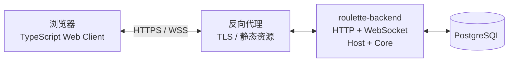

# 《俄罗斯轮盘》Web 公网版开发路径

> 状态：暂缓。当前开发优先级已切换到[本地 Web MVP](local-web-mvp.md)，先验证 Core、Host、简化 Bot 与浏览器交互。本文件保留为本地玩法稳定后的公网支线规划，其中部分范围和里程碑需要届时重新评审。

## 1. 路线定义

这条支线的目标是：玩家打开浏览器即可创建或加入房间，由部署在服务器上的后端承载唯一权威对局，至少 3 名玩家可以完成一局《俄罗斯轮盘》。

首版采用模块化单体，不拆 Gateway/Worker：



权威调用链只有一条：

```text
Web 操作
  → PlayerCommand
  → roulette-backend 中的 Host 命令队列
  → Core.apply_command
  → GameEvent / PlayerView
  → 保存并广播
  → Web 动画与播报
```

浏览器可以预测按钮状态或播放动画，但不能决定命中、死亡、随机事件、地形变化或胜负。

## 2. 首版范围

### 2.1 必须完成

- 游客身份或轻量账号进入游戏。
- 创建房间、房间码加入、离开与创建者开始。
- 最低 3 人开局，固定行动顺序和 1 分 30 秒行动超时。
- 地图生成、玩家出生、移动、攻击/射击、等待、自裁。
- 左轮、基础地形、肘击、传送、地雷、水域和胜负结算。
- 当前行动者提示、合法行动提示、玩家状态、事件播报和结算页。
- 刷新或短暂断线后恢复身份、revision 和 PlayerView。
- 快照、命令/事件日志、幂等重试、回放与基础运维指标。

### 2.2 暂不进入首版

- Gateway + Match Worker 微服务拆分。
- LAN 发现、桌面封装和 QQ 群适配器重写。
- 房主迁移、观战、赛季、商城和复杂社交系统。
- 让 LLM 自由决定权威结果。
- 百人实时动作同步或 WebTransport。

## 3. 开发顺序

### 3.1 W0：规则与协议收口

先把现有文字规则变成与界面无关的领域契约：

- 房间命令：`CreateMatch`、`JoinMatch`、`StartMatch`；局内 `PlayerCommand`：`Move`、`Shoot`、`Attack`、`UseItem`、`Wait`、`Suicide`。
- `GameState` 保存完整状态和隐藏信息；`PlayerView` 只暴露当前玩家可见内容。
- 每条命令携带 `actor_id`、`expected_revision` 和 `idempotency_key`。
- 每个结果使用结构化 `GameEvent` 表达，播报文字不是唯一事实来源。
- 协议、规则和内容分别具有版本号；存档绑定相应版本。

退出条件：QQ 文字指令和 Web 控件都能无歧义映射到同一种命令，规则文档中不再存在只有主持系统隐式理解、却未被结构化记录的状态。

### 3.2 W1：确定性 Core 垂直切片

按最短可玩链路实现，而不是先实现所有地形：

1. 创建一局并固定规则版本和 seed。
2. 生成地图、出生点和行动顺序。
3. 校验并执行移动、射击、等待和自裁。
4. 结算死亡、回合推进、胜利或平局。
5. 投影不同玩家的 `PlayerView`。
6. 输出 `GameEvent`、revision 和 `state_hash`。

随后再依次补肘击、水域、传送、门、地雷、物品和连锁事件。每一种规则都先有固定 seed 的测试，再接入 UI。

退出条件：同一初始状态与命令序列在重复运行时得到完全相同的事件、状态和哈希；Core 不访问网络、数据库、文件、系统时间或外部 LLM。

### 3.3 W2：Host 与房间运行时

在内存中先完成一局的生命周期，再接数据库：

- `CREATING → WAITING_PLAYERS → RUNNING → FINISHED → ARCHIVED`。
- 一局一个串行命令队列，任何写操作都经过队列。
- 玩家槽位、创建者权限、最低人数、行动计时和默认超时动作。
- actor token 重连、revision 重同步和重复幂等键回放原结果。
- 每条已确认命令后保存日志，按策略生成快照。

退出条件：三个无界面测试客户端可以建房、加入并完成一局；模拟重复、乱序、超时和断线后，状态仍一致。

### 3.4 W3：Web 假数据交互原型

Web UI 不等待后端完成。它先消费固定的 `PlayerView` 和 `GameEvent` 样本，验证完整页面状态流：

| **页面/区域** | **核心内容** |
|---------------|--------------|
| 首页 | 创建房间、输入房间码、恢复上次会话。 |
| 等待室 | 玩家列表、创建者标识、开局人数与开始条件。 |
| 对局页 | 地图、当前行动者、倒计时、行动控件、玩家状态、事件播报。 |
| 重连状态 | 正在重连、版本过旧、房间结束或身份失效。 |
| 结算页 | 胜者/平局、关键事件、再来一局、回放入口。 |

客户端状态至少分为三层：服务器 `PlayerView`、连接状态、纯表现状态。动画完成度、弹窗开关等表现状态不得回写为权威游戏状态。

退出条件：使用假数据可以从建房走到结算；窄屏和桌面宽屏均可完成所有行动；UI 中没有自行计算命中或胜负的逻辑。

### 3.5 W4：roulette-backend 与 PostgreSQL

首版后端在一个进程内组合接入层、Host、Core 和存储适配器。

最小 HTTP 能力：

- 创建/恢复游客会话。
- 创建房间、按房间码查询并加入。
- 获取服务健康、协议版本和内容版本。

最小 WebSocket 能力：

- 使用 actor token 连接或恢复对局。
- 接收 `PlayerViewSnapshot`、增量事件、当前 revision 和计时信息。
- 提交 `PlayerCommand`、确认 server sequence、请求重新同步。
- 返回结构化错误，例如非当前回合、版本冲突、内容不匹配和房间已结束。

最小持久化集合：

- 会话/身份与房间元数据。
- Match 成员和 actor token 的安全引用。
- Snapshot、Command Log、Domain Event Log 和 state hash。
- 幂等键与首次执行结果。

退出条件：后端重启后可从快照和日志恢复未结束房间；已经提交的命令不会丢失，未提交事务不会留下半个状态。

### 3.6 W5：真实端到端对局

使用生成的 TypeScript 协议类型连接 Web 与后端，按以下顺序接通：

1. 游客会话和建房。
2. 三个浏览器标签页加入同一房间。
3. 创建者开始，所有客户端收到各自的 PlayerView。
4. 当前玩家提交动作，服务端保存后广播事件和新视图。
5. 非当前玩家操作被明确拒绝。
6. 刷新其中一个页面并恢复到正确 revision。
7. 完成胜负结算并生成可重放记录。

退出条件：三浏览器完整对局稳定通过；重复点击、网络重试、乱序包、刷新和短暂断网不会造成重复行动或状态分叉。

### 3.7 W6：公网测试环境

部署顺序保持简单：静态 Web、反向代理/TLS、单个 `roulette-backend` 和 PostgreSQL。上线前验证：

- 数据库迁移可前进，并明确回滚或恢复策略。
- backend 收到终止信号后停止新房间、保存活跃对局并优雅关闭。
- 日志能够按 request、actor、match 和 revision 关联，但不记录明文 token。
- 指标至少覆盖在线连接、活跃房间、命令延迟、命令拒绝、重连、快照失败和恢复失败。
- 数据库有自动备份，并实际完成一次恢复演练。
- 旧客户端连接不兼容服务端时得到明确升级提示。

退出条件：测试环境能够部署、升级、重启恢复和导出回放；故障演练结果有记录。

### 3.8 W7：内容与表现扩展

基础链路稳定后再增加更多地形、道具、动画、音效、Bot 和 LLM 播报。每次扩展先改规则数据/Core 和回放测试，再改各端表现，避免 Web 变成第二套规则实现。

## 4. LLM 与原 QQ 主持逻辑的迁移方式

原规则允许主持 Bot 根据局势自由裁定事件，这与公网版的确定性、重放和公平性存在冲突。Web 首版采用以下拆分：

1. Core 根据显式 RNG、地图、玩家状态和结构化事件池决定事实。
2. Core 输出事件等级、原因、目标、伤亡、位移、地形和物品变化。
3. 模板播报器或 LLM 只将这些事实写成短播报。
4. 客户端根据相同事实播放动画和音效。

因此，即使 LLM 超时、不可用或换模型，游戏事实也不改变。若未来确实需要 LLM 参与裁定，服务端必须把候选范围、LLM 选择和校验结果完整记录为命令上下文，使回放不需要再次调用模型。

## 5. 首批实现任务

按依赖关系，首批任务应从共享契约开始：

1. 建立 `roulette-domain`，定义 ID、Match 状态、命令、事件、视图、错误和版本。
2. 建立 `roulette-core`，完成三人最小地图、移动、射击、死亡和胜负。
3. 建立固定 seed 的 Golden Replay 和状态哈希测试。
4. 建立 `roulette-host`，完成房间生命周期与串行命令队列。
5. 定义 WebSocket 信封并生成 TypeScript 客户端类型。
6. 用样本 PlayerView 搭建 Web 等待室和对局页。
7. 建立 `roulette-backend`，先用内存存储跑通三个客户端。
8. 接入 PostgreSQL、快照/日志、重连与幂等。
9. 完成三浏览器端到端测试，再部署公网测试环境。

这条顺序的第一项产品验收不是“页面已经很好看”，而是“同一局的三个浏览器始终看到与各自身份一致、且来自唯一权威状态的结果”。

## 6. 进入开发前仍需冻结的产品决定

以下选择不会阻止搭建 Core/Host 骨架，但应在 W0 结束前写入规则配置：

- 首版只支持游客房间，还是同时提供正式账号。
- 房间默认人数上限，以及是否允许 Bot 补足最低 3 人。
- 全图视野是否继续作为 Web 首版默认值。
- 1 分 30 秒超时后是高概率死亡事件，还是先执行一次托管动作。
- 普通/少见/稀有/史诗/传奇事件的概率是否保持当前规则。
- 首版启用的地形和物品白名单。
- 对局结束后回放保留时长与公开范围。
