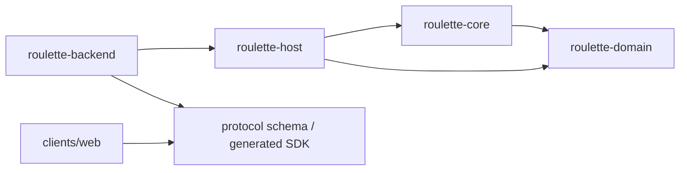

# 模块划分

## 当前 Rust 模块

| **Cargo 包** | **Rust crate 名** | **状态** | **职责** | **允许依赖** |
|---------------|-------------------|----------|----------|--------------|
| `roulette-domain` | `roulette_domain` | 骨架 | 稳定 ID、命令、事件、状态、视图、错误与版本数据。 | 标准库及少量纯数据依赖。 |
| `roulette-core` | `roulette_core` | 骨架 | 命令校验、状态转移、显式 RNG、事件生成和视图投影。 | `roulette-domain`。 |
| `roulette-host` | `roulette_host` | 骨架 | 房间生命周期、玩家槽位、单局队列、重连、超时、Bot 调度和持久化端口。 | `roulette-core`、`roulette-domain`。 |
| `roulette-backend` | 不作为库导出 | 骨架 | 公网服务组合入口，后续接入 HTTP/WSS、Host、存储和进程生命周期；服务器容器以同名服务运行。 | 首先依赖 `roulette-host`；适配器按需增加。 |

## 依赖方向

依赖不得反向：`roulette-domain` 不认识 Core、Host 或客户端；`roulette-core` 不认识网络、数据库、文件和进程；客户端不链接权威规则。

## 计划中的模块

以下名称只保留边界，不在没有实现需求时创建空工程：

| **候选模块** | **触发创建的条件** |
|--------------|--------------------|
| `roulette-protocol` | 网络 schema 和领域类型之间需要稳定转换层。 |
| `roulette-transport-websocket` | WebSocket 接入需要从应用入口中提取为复用适配器。 |
| `roulette-storage-postgres` | PostgreSQL 表结构和持久化端口冻结。 |
| `roulette-storage-sqlite` | 本地节点或离线 CLI 开始实现。 |
| `roulette-replay` | Golden Replay 与用户回放需要共用格式。 |
| `roulette-bot-api` | 外部 Bot 或 Python SDK 开始接入。 |
| `roulette-node` | 本地/LAN 权威节点进入开发。 |
| `roulette-cli` | 调试、自动化或 LLM Skill 需要稳定命令入口。 |

## 非 Rust 部分

- `clients/web`：当前优先客户端，计划使用 TypeScript；具体框架未定。
- `protocol`：作为 Rust、TypeScript、Python 等语言共享契约的来源。
- `scripts`：允许使用适合任务的 Shell、Python、JavaScript 或 Rust，但必须记录运行环境和输入输出。

## 部署映射

- 源码应用：`apps/roulette-backend`。
- 仓库内服务器模板：`deploy/srv/apps/roulette`。
- 本机服务器影子：`/Users/akimotokaya/Documents/srv/apps/roulette`。
- 服务器实际路径：`~/srv/apps/roulette`。
- Compose 服务名：`roulette-backend`；共享 `srv_edge` 网络中的反向代理上游为 `roulette-backend:8080`。
