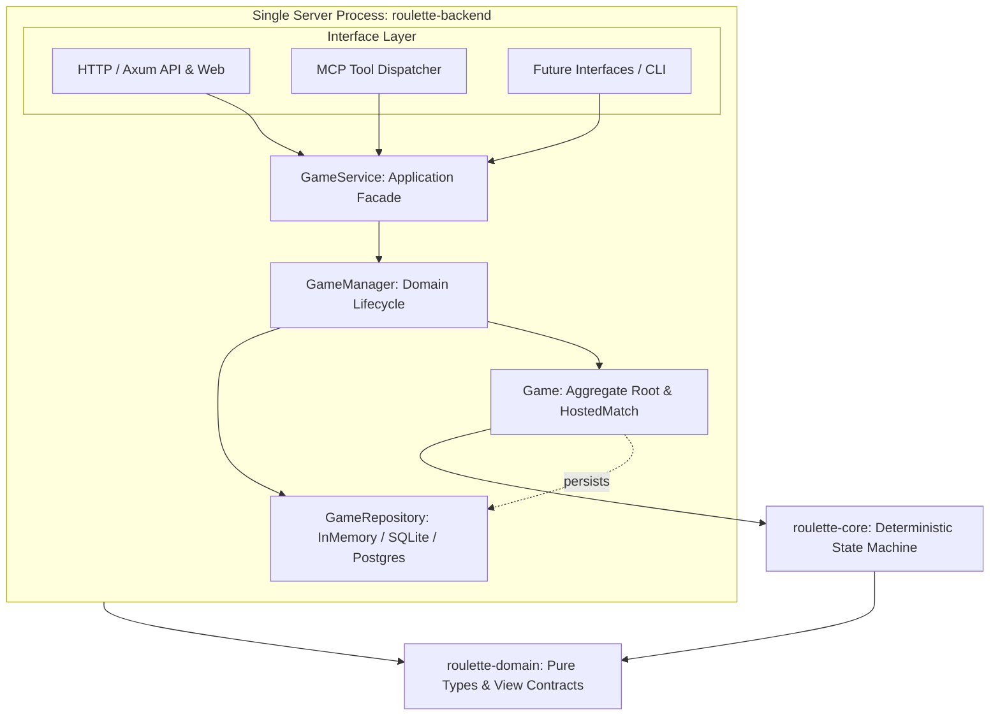

# 模块划分

## 当前 Rust 模块

| **Cargo 包** | **Rust crate 名** | **状态** | **职责** | **允许依赖** |
|---------------|-------------------|----------|----------|--------------|
| `roulette-domain` | `roulette_domain` | MVP 已实现 | 可序列化的 Tab/房间/成员/玩家 ID、EventId、EventTier、Weather、冰面地形、房间视图、命令、分类记录、事件/戏剧化事件、通知、权威状态、事件诊断树流水（CandidateTrace、EventNodeTrace、PipelineTrace，含 is_lethal 与 stalemate_rounds 标定）、地形三维属性规范契约（`TerrainLayer`：地上/地下/地上且地下/特殊，`TerrainProperties`：位置、硬度、被摧毁转换与战术说明）、随机流、Web 视图及淘汰死因（含 Collision 猛烈撞墙）。 | `serde`；不依赖运行时。 |
| `roulette-core` | `roulette_core` | MVP 已实现 | 确定性地图生成、命令校验、状态转移、显式 RNG、事件树 BFS 管线（`EventTreePipeline`）、事件定义索引库（`EventRegistry`）、多因素动态概率评估模型（`EventPool`，含基础移动 75% 正常行动基线、行动级行动未减员递增计数、差异化带权致死事件与概率上限截断机制 `LethalScope` / `max_probability_permille`）、统一事件层枪膛判定（移除底层物理层硬编码 25% 随机空膛及连续 3 次空膛判定，改由 `shoot_intent` 中的 `evt_revolver_misfire` 统一裁定与叙事，彻底杜绝打出穿甲弹又被判定枪膛为空的逻辑矛盾）、基于硬度与位置合法性保护的弹道破坏机制（普通弹击碎硬度 1 木箱停下、穿甲重弹击碎硬度 2 墙体并贯穿前行、地下地雷免疫子弹）、智能 Bot 决策（移除等待，4 向直视射击，BFS 寻敌且避开地雷等负面机关）、环境天气与冰面相变、胜负和视图投影。 | `roulette-domain`。 |
| `roulette-host` | `roulette_host` | 本地多房间 MVP | 解耦的领域管理与应用服务层：应用服务门面（`GameService`，统一暴露与协议无关的用例）、领域管理层（`GameManager`，管理多房间生命周期与短码分配）、实体聚合层（`Game`，封装房间席位、Bot 调度与对局推进）、仓储抽象契约（`GameRepository`，默认基于线程安全内存实现，预留后续接入 SQLite / PostgreSQL 持久化）。 | `roulette-core`、`roulette-domain`、`serde`。 |
| `roulette-backend` | 不作为库导出 | 本地 Web / MCP 服务端 | 单进程服务组装根与多接口适配层：HTTP 适配器（Axum Web/API 路由、前端静态资源嵌入、局域网控制中间件）、MCP 适配器（Model Context Protocol 标准工具契约与 `McpDispatcher` 派发器，支持工具列举与 JSON 分发调用）。两套接口并列在同一进程中直接调用 `GameService`。 | `roulette-host`、`roulette-domain`、Axum、Tokio、`serde_json`。 |

## 依赖与分层架构

```text
┌──────────────────────────────────────┐
│        server (roulette-backend)     │
│                                      │
│   HTTP        MCP        其他接口层  │
│    │           │          │          │
│    └───────────┼──────────┘          │
│                ▼                     │
│           GameService                │
│                │                     │
│           GameManager                │
│                │                     │
│             Game                     │
│                │                     │
│        Rules / State Machine         │
│                │                     │
│           Repository                 │
│                │                     │
│   InMemory / (SQLite / PostgreSQL)   │
│                                      │
└──────────────────────────────────────┘
```



依赖严格单向：接口层（HTTP/MCP）调用 `GameService`；`GameService` 协调 `GameManager`；`GameManager` 与 `Game` 依赖 `GameRepository` 与 `roulette-core`；`roulette-core` 保持纯粹确定性状态机。


## 计划中的模块

以下名称只保留边界，不在没有实现需求时创建空工程：

| **候选模块** | **触发创建的条件** |
|--------------|--------------------|
| `roulette-protocol` | 网络 schema 和领域类型之间需要稳定转换层。 |
| `roulette-transport-websocket` | WebSocket 接入需要从应用入口中提取为复用适配器。 |
| `roulette-storage-postgres` | PostgreSQL 表结构和持久化端口冻结。 |
| `roulette-storage-sqlite` | 本地节点或离线 CLI 开始实现。 |
| `roulette-replay` | Golden Replay 与用户回放需要共用格式。 |
| `roulette-bot-api` | 外部 Bot 或 Python SDK 开始接入。 |
| `roulette-node` | 本地/LAN 权威节点进入开发。 |
| `roulette-cli` | 调试、自动化或 LLM Skill 需要稳定命令入口。 |

## 非 Rust 部分

- `clients/web`：当前为无构建的 HTML/CSS/JavaScript 本地客户端；使用 `sessionStorage` 保存 Tab ID 与所在房间。界面按品牌封面、房间大厅、模态操作、房间成员和对局棋盘分层，房间列表占据大厅主要视野，创建/加入/单人模拟/创始人设置按需弹出；桌面图例区与工具栏提供“特殊地形属性”Help 模态框，当前地图存在的特殊地形优先置顶展示并涵盖全部地形硬度、位置层级与穿甲弹破坏规则；正下方对局时间线按“玩家单次回合框”（`.turn-frame-card`）归组展示，单列倒序（最新回合置顶），框内聚合该回合行动与产生的所有连锁事件（高亮致命淘汰与戏剧事件）；桌面头部实时展示连续未减员行动数（`🔥 僵局 X 次未减员 (致死率提升)`）；房间左侧栏常驻事件决策树检查器（亦保留 F2 快捷键与放大模态），实时展示权威后端 BFS 事件树、阻尼与致死动态权重评估、`[致死]` 危险徽章与结算效果，轮询机制已与模态关闭解耦。公网版框架未定。
- `protocol`：作为 Rust、TypeScript、Python 等语言共享契约的来源。
- `scripts`：允许使用适合任务的 Shell、Python、JavaScript 或 Rust，但必须记录运行环境和输入输出。

## 部署映射

- 源码应用：`apps/roulette-backend`。
- 仓库内服务器模板：`deploy/srv/apps/roulette`。
- 本机服务器影子：`/Users/akimotokaya/Documents/srv/apps/roulette`。
- 服务器实际路径：`~/srv/apps/roulette`。
- Compose 服务名：`roulette-backend`；共享 `srv_edge` 网络中的反向代理上游为 `roulette-backend:8080`。
