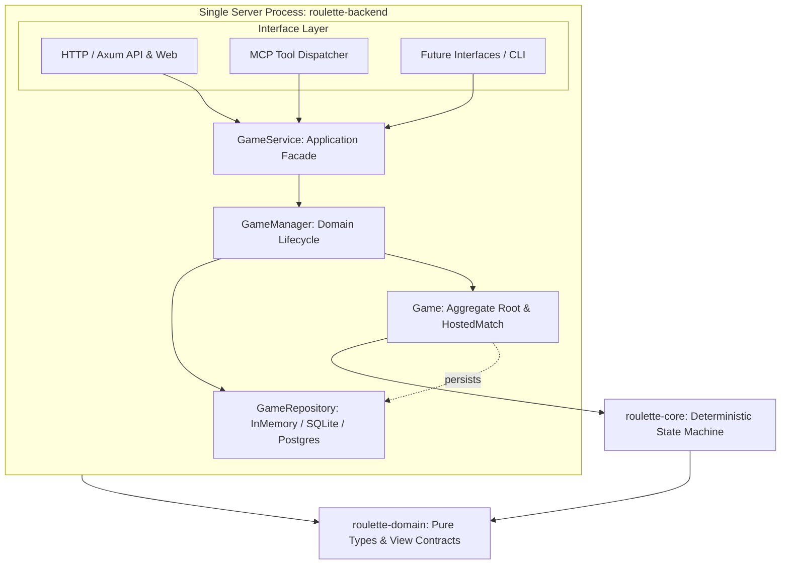

# 模块划分

## 当前 Rust 模块

| **Cargo 包** | **Rust crate 名** | **状态** | **职责** | **允许依赖** |
|---------------|-------------------|----------|----------|--------------|
| `roulette-domain` | `roulette_domain` | MVP 已实现 | 可序列化的 Tab/房间/成员/玩家 ID、统一身份抽象（`UserIdentity`、`IdentityKind`：临时 Tab 与公网认证账号兼容插槽）、运行模式契约（`ServerMode`：Local 与 Public）、EventId、EventTier、Weather、冰面地形、房间视图、命令、分类记录、事件/戏剧化事件、通知、权威状态、事件诊断树流水（CandidateTrace、EventNodeTrace、PipelineTrace，含 is_lethal 与 stalemate_rounds 标定）、地形三维属性规范契约（`TerrainLayer`：地上/地下/地上且地下/特殊，`TerrainProperties`：位置、硬度、被摧毁转换与战术说明）、随机流、Web 视图及淘汰死因（含 Collision 猛烈撞墙）。 | `serde`；不依赖运行时。 |
| `roulette-core` | `roulette_core` | MVP 已实现 | 确定性地图生成、命令校验、状态转移、显式 RNG、事件树 BFS 管线（`EventTreePipeline`）、事件定义索引库（`EventRegistry`）、多因素动态概率评估模型（`EventPool`，含基础移动 75% 正常行动基线、行动级行动未减员递增计数、差异化带权致死事件与概率上限截断机制 `LethalScope` / `max_probability_permille`）、统一事件层枪膛判定（移除底层物理层硬编码 25% 随机空膛及连续 3 次空膛判定，改由 `shoot_intent` 中的 `evt_revolver_misfire` 统一裁定与叙事，彻底杜绝打出穿甲弹又被判定枪膛为空的逻辑矛盾）、基于硬度与位置合法性保护的弹道破坏机制（普通弹击碎硬度 1 木箱停下、穿甲重弹击碎硬度 2 墙体并贯穿前行、地下地雷免疫子弹）、智能 Bot 决策（移除等待，4 向直视射击，BFS 寻敌且避开地雷等负面机关）、环境天气与冰面相变、胜负和视图投影。 | `roulette-domain`。 |
| `roulette-host` | `roulette_host` | 本地多房间 MVP | 解耦的领域管理与应用服务层：应用服务门面（`GameService`，统一暴露与协议无关的用例，支持 `ServerMode` 注入与运行时配置）、领域管理层（`GameManager`，管理多房间生命周期与短码分配）、实体聚合层（`Game`，封装房间席位、Bot 调度与对局推进）、仓储抽象契约（`GameRepository`，默认基于线程安全内存实现，预留后续接入 SQLite / PostgreSQL 持久化）。 | `roulette-core`、`roulette-domain`、`serde`。 |
| `roulette-backend` | `roulette_backend` (库) / `roulette-backend` (自适应二进制) | 共享服务引擎与入口 | 单进程服务组装根与多接口适配引擎库：HTTP 适配器（Axum Web/API 路由、前端静态资源嵌入、高层身份提炼 `resolve_identity`、基于模式的访问守卫中间件 `access_guard`）、MCP 适配器（Model Context Protocol 标准工具契约与 `McpDispatcher` 派发器）。既作为共享库供 `roulette-local` 与 `roulette-server` 调用，也保留原有默认二进制供 Docker/脚本自适应环境启动。 | `roulette-host`、`roulette-domain`、Axum、Tokio、`serde_json`、`rmcp`、`schemars`。 |
| `roulette-local` | 不作为库导出 | 独立入口 | 本地局域网模式专有入口（极简装配层 ~15 行），绑定端口 8787，强制启用回环防护与创始人临时密码验证，提供给单机用户与局域网联机。 | `roulette-backend`、Tokio。 |
| `roulette-server` | 不作为库导出 | 独立入口 | 公网中央服务器模式专有入口（极简装配层 ~15 行），绑定端口 8080，直接放行公网反向代理流量，接入管理员凭据与未来中心认证体系。 | `roulette-backend`、Tokio。 |


## 依赖与分层架构

```text
┌──────────────────────────────────────┐
│        server (roulette-backend)     │
│                                      │
│   HTTP        MCP        其他接口层  │
│    │           │          │          │
│    └───────────┼──────────┘          │
│                ▼                     │
│           GameService                │
│                │                     │
│           GameManager                │
│                │                     │
│             Game                     │
│                │                     │
│        Rules / State Machine         │
│                │                     │
│           Repository                 │
│                │                     │
│   InMemory / (SQLite / PostgreSQL)   │
│                                      │
└──────────────────────────────────────┘
```



依赖严格单向：接口层（HTTP/MCP）调用 `GameService`；`GameService` 协调 `GameManager`；`GameManager` 与 `Game` 依赖 `GameRepository` 与 `roulette-core`；`roulette-core` 保持纯粹确定性状态机。

### MCP 接口层与裁判/主持人角色模型 (Referee Role Model)

- **传输与协议握手**：
  - 基于官方 Rust SDK `rmcp` (v3.4.0) 构建，完全托管 MCP 协议握手、工具发现（`tools/list`）、请求路由（`tools/call`）和 HTTP Streamable Transport。
  - 在保持全系统单进程（除前端外）约束下，将 `StreamableHttpService` 作为 Tower service 挂载至 Axum 路由 `/mcp`，同时兼容现有轻量 HTTP JSON 端点 `/api/mcp/tools` 和 `/api/mcp/call`。
- **调用者权限与视角**：
  - 当前阶段接入的 MCP Agent 统一赋予**“裁判 / 主持人”特权身份 (`CallerRole::Referee`)**。
  - 拥有全知无遮挡视角 (`RefereeRoomView` / `RefereeGameView`)：可实时检查棋盘所有格子、所有玩家真实坐标与血量状态、行动与事件流水、以及完整的事件决策树 Traces。
  - 房间持久性保护：裁判创建的房间带有 `referee_managed: true` 标记，即便全员为 Bot 且真人 Tab 离开也不会被垃圾回收例程自动销毁，必须由裁判显式解散 (`referee_dissolve_room`)。
  - 架构为未来普通玩家客户端通过 MCP 入座保留了清晰的扩展边界 (`CallerRole::Player`)。
- **权威工具集合 (Tool APIs)**：
  1. `referee_list_rooms`: 检索大厅所有房间摘要，支持阶段过滤。
  2. `referee_inspect_room`: 获取指定房间全知无遮挡的对局数据。
  3. `referee_create_room`: 主持创建新战局，可预填 Bot 席位与密码。
  4. `referee_setup_bots`: 等待阶段增减 Bot 席位。
  5. `referee_start_match`: 开启比赛，支持注入确定性种子以便复现与测试。
  6. `referee_step_bot`: 推进当前轮次的 Bot 执行一步智能决策，演化状态并递增版本。
  7. `referee_force_command`: 强裁或代行当前轮次玩家执行指定指令（移动/射击/等待/自杀）。
  8. `referee_dissolve_room`: 强制关闭并清理对局。
  9. `referee_query_rules`: 获取游戏权威规则、地形硬度层级与穿甲弹破坏机制。
- **并发与幂等约束**：
  - **乐观并发控制 (OCC)**：写操作（`setup_bots`, `start_match`, `step_bot`, `force_command`）必须携带 `expected_revision`，版本冲突时直接以标准结构化错误拦截 (`REVISION_CONFLICT`)。
  - **内存短期幂等缓存**：`GameService` 内置短期基于 `(room_id, idempotency_key)` 的缓存，有效防止 LLM 或网络重试导致的重复步进或重复开局。

### 双入口模式与无重复代码设计 (Dual Entrypoints & Zero Duplication)

为了同时满足本地单机/局域网私密运行与公网服务器集中部署的需求，仓库提供了独立的双二进制入口，但坚决杜绝代码重复：

- **极简组装根 (Composition Roots)**：
  - `apps/roulette-local`：本地局域网专用入口（仅 ~15 行），预设模式 `ServerMode::Local`，默认端口 `8787`，激活本地回环检查与临时创始人密码认证，保护局域网未授权暴露。
  - `apps/roulette-server`：公网中央服务器专用入口（仅 ~15 行），预设模式 `ServerMode::Public`，默认端口 `8080`，放行反向代理流量，接入管理员 Token。
  - `apps/roulette-backend`：兼容入口，通过环境变量 `ROULETTE_SERVER_MODE` 或命令行参数自适应启动，确保既有 Docker/Compose 部署模板无缝兼容。
- **差异严格压制在高层**：
  - 在底层领域模型（`roulette-domain`）中抽象了统一的 `UserIdentity` 契约（包含 `IdentityKind::TemporaryTab` 与 `IdentityKind::Authenticated`）。
  - 在接口层顶层（`handlers.rs`）通过 `resolve_identity` 将客户端的 `TabId` 转化为临时会话身份，未来中央服务器上线真实用户认证时，只需在顶层将 Token 转化为 `IdentityKind::Authenticated`，下层业务用例（`GameService` / `GameManager` / `Game`）无需任何修改。
- **严禁代码复制原则**：
  - HTTP 路由、Axum 处理器、MCP 工具派发、状态机、事件管线和仓储代码 100% 驻留在公共库中。
  - 严禁因为存在两个独立构建的应用而产生重复或相似的业务逻辑代码，所有新功能与改动必须在共同兼容的库代码中完成。


## 计划中的模块

以下名称只保留边界，不在没有实现需求时创建空工程：

| **候选模块** | **触发创建的条件** |
|--------------|--------------------|
| `roulette-protocol` | 网络 schema 和领域类型之间需要稳定转换层。 |
| `roulette-transport-websocket` | WebSocket 接入需要从应用入口中提取为复用适配器。 |
| `roulette-storage-postgres` | PostgreSQL 表结构和持久化端口冻结。 |
| `roulette-storage-sqlite` | 本地节点或离线 CLI 开始实现。 |
| `roulette-replay` | Golden Replay 与用户回放需要共用格式。 |
| `roulette-bot-api` | 外部 Bot 或 Python SDK 开始接入。 |
| `roulette-node` | 本地/LAN 权威节点进入开发。 |
| `roulette-cli` | 调试、自动化或 LLM Skill 需要稳定命令入口。 |

## 非 Rust 部分

- `clients/web`：当前为无构建的 HTML/CSS/JavaScript 本地客户端；使用 `sessionStorage` 保存 Tab ID 与所在房间。界面按品牌封面、房间大厅、模态操作、房间成员和对局棋盘分层，房间列表占据大厅主要视野，创建/加入/单人模拟/创始人设置按需弹出；桌面图例区与工具栏提供“特殊地形属性”Help 模态框，当前地图存在的特殊地形优先置顶展示并涵盖全部地形硬度、位置层级与穿甲弹破坏规则；正下方对局时间线按“玩家单次回合框”（`.turn-frame-card`）归组展示，单列倒序（最新回合置顶），框内聚合该回合行动与产生的所有连锁事件（高亮致命淘汰与戏剧事件）；桌面头部实时展示连续未减员行动数（`🔥 僵局 X 次未减员 (致死率提升)`）；房间左侧栏常驻事件决策树检查器（亦保留 F2 快捷键与放大模态），实时展示权威后端 BFS 事件树、阻尼与致死动态权重评估、`[致死]` 危险徽章与结算效果，轮询机制已与模态关闭解耦。公网版框架未定。
- `clients/astrbot_plugin_russian_roulette`：AstrBot 聊天机器人插件（独立 Git 仓库子项目）。作为对局主持人与战况展示端，让 QQ/IM 用户通过纯指令（`/rr`、`/轮盘`）参与对战，通过 MCP 协议与 Rust 游戏引擎对接。为满足独立推送到 GitHub 并上架 AstrBot 插件市场的要求，该目录被主仓库 `.gitignore` 忽略，并配置独立的 Git 仓库与 AstrBot 插件规范文件（`metadata.yaml`、`_conf_schema.json`、Logo 与单体测试）。
- `protocol`：作为 Rust、TypeScript、Python 等语言共享契约的来源。
- `scripts`：允许使用适合任务的 Shell、Python、JavaScript 或 Rust，但必须记录运行环境和输入输出。

## 部署映射

- 源码应用：`apps/roulette-backend`。
- 仓库内服务器模板：`deploy/srv/apps/roulette`。
- 本机服务器影子：`/Users/akimotokaya/Documents/srv/apps/roulette`。
- 服务器实际路径：`~/srv/apps/roulette`。
- Compose 服务名：`roulette-backend`；共享 `srv_edge` 网络中的反向代理上游为 `roulette-backend:8080`。
