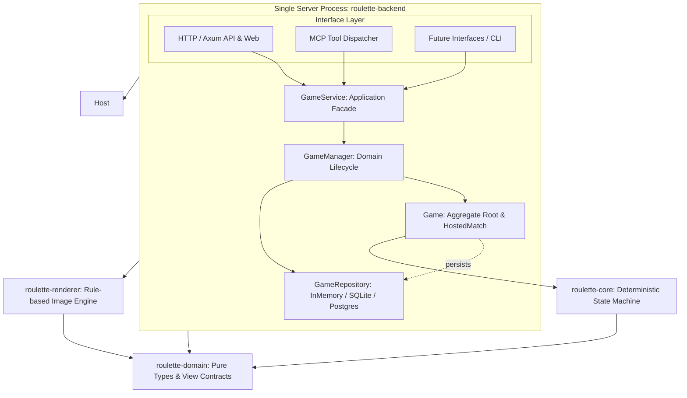

# 模块划分

## 当前 Rust 模块

| **Cargo 包** | **Rust crate 名** | **状态** | **职责** | **允许依赖** |
|---------------|-------------------|----------|----------|--------------|
| `roulette-domain` | `roulette_domain` | MVP 已实现 | 可序列化的 Tab/房间/成员/玩家 ID、统一身份抽象（`UserIdentity`、`IdentityKind`：临时 Tab 与公网认证账号兼容插槽）、运行模式契约（`ServerMode`：Local 与 Public）、EventId、EventTier、Weather、基础地面地形（`Terrain`：Plain, Water, HighGround, Ice）与上覆地图物体（`MapObject`：Wall, Crate, Mine, Shield）解耦契约、物体分类（`MapObjectKind`：Cover/Trap/Pickup）、物体机械属性契约（`MapObjectProperties`：硬度、分类、是否阻挡移动与子弹）、纯地面属性契约（`TerrainProperties`：类型、名称与战术说明）、房间视图、分层单元格视图（`CellView`：terrain 与 object）、命令、分类记录、事件/戏剧化事件（新增 `ObjectPlaced`、`ObjectDestroyed`，`ItemCollected` 记录具体物体）、通知、权威状态（`state.terrain` 与 `state.objects` 分离）、事件诊断树流水（CandidateTrace、EventNodeTrace、PipelineTrace，含 is_lethal 与 stalemate_rounds 标定）、随机流、Web 视图及淘汰死因（含 Collision 猛烈撞墙）。 | `serde`；不依赖运行时。 |
| `roulette-core` | `roulette_core` | MVP 已实现 | 确定性双层地图生成（先生成底层水域/高地/冰面，再在上层放置墙体/木箱/地雷/护盾）、命令校验、状态转移、显式 RNG、事件树 BFS 管线（`EventTreePipeline`）、事件定义索引库（`EventRegistry`）、多因素动态概率评估模型（`EventPool`，含基础移动 75% 正常行动基线、行动级行动未减员递增计数、差异化带权致死事件与概率上限截断机制 `LethalScope` / `max_probability_permille`）、统一事件层枪膛判定（由 `shoot_intent` 中的 `evt_revolver_misfire` 统一裁定与叙事）、基于硬度与阻挡特性的纯掩体弹道破坏机制（子弹只与上层物体与玩家碰撞，普通弹击碎硬度 1 木箱停下、穿甲重弹击碎硬度 2 墙体并贯穿前行、地雷与护盾不阻挡子弹掠过；物体被摧毁后直接消除 `object = None`，底层冰面/高地/平地完好保留，彻底消除木箱变平地的伪地形转换）、智能 Bot 决策（4 向直视射击，BFS 寻敌避险且识别物体阻挡）、环境天气与冰面相变、胜负和分层视图投影。 | `roulette-domain`。 |
| `roulette-host` | `roulette_host` | 本地多房间 MVP | 解耦的领域管理与应用服务层：应用服务门面（`GameService`，统一暴露与协议无关的用例，支持 `ServerMode` 注入与运行时配置，提供 `get_terrain_rules()` 与 `get_object_rules()`）、领域管理层（`GameManager`，管理多房间生命周期与短码分配）、实体聚合层（`Game`，封装房间席位、Bot 调度与对局推进）、仓储抽象契约（`GameRepository`，默认基于线程安全内存实现，预留后续接入 SQLite / PostgreSQL 持久化）。 | `roulette-core`、`roulette-domain`、`serde`。 |
| `roulette-renderer` | `roulette_renderer` | MVP 已实现 | 输出层规则图片合成引擎：按照确定性规则与领域模型（非 LLM 生成），分层将权威房间/对局视图（基础地面 Tint 层、独立地图物体掩体与道具层 `object-layer`、玩家棋子层与弹道特效层）合成渲染为高精度矢量 SVG 或高质量抗锯齿 PNG 战术图片；`ObjectAssetRenderer` 绘制高硬度石墙、易碎木箱、地雷警戒与护盾晶体；`assets/tilesheet` 分组全览 4 种地面地形与 4 种独立物体。 | `roulette-domain`、`resvg`、`thiserror`；不依赖 Core/Host。 |
| `roulette-backend` | `roulette_backend` (库) / `roulette-backend` (自适应二进制) | 共享服务引擎与入口 | 单进程服务组装根与多接口适配引擎库：HTTP 适配器（Axum Web/API 路由、提供 `/api/rules/terrains` 与 `/api/rules/objects` 独立规范查询、前端静态资源嵌入、高层身份提炼 `resolve_identity`、基于模式的访问守卫中间件 `access_guard`）、MCP 适配器（`referee_query_rules` 升级返回地形与物体双层规则，新增 `get_object_properties` 工具）。既作为共享库供 `roulette-local` 与 `roulette-server` 调用，也保留原有默认二进制供 Docker/脚本自适应环境启动。 | `roulette-host`、`roulette-renderer`、`roulette-domain`、Axum、Tokio、`serde_json`、`rmcp`、`schemars`。 |
| `roulette-local` | 不作为库导出 | 独立入口 | 本地局域网模式专有入口（极简装配层 ~15 行），绑定端口 8787，强制启用回环防护与创始人临时密码验证，提供给单机用户与局域网联机。 | `roulette-backend`、Tokio。 |
| `roulette-server` | 不作为库导出 | 独立入口 | 公网中央服务器模式专有入口（极简装配层 ~15 行），绑定端口 8080，直接放行公网反向代理流量，接入管理员凭据与未来中心认证体系。 | `roulette-backend`、Tokio。 |


## 依赖与分层架构

```text
┌──────────────────────────────────────┐
│        server (roulette-backend)     │
│                                      │
│   HTTP        MCP        其他接口层  │
│    │           │          │          │
│    └───────────┼──────────┘          │
│                ▼                     │
│           GameService                │
│                │                     │
│           GameManager                │
│                │                     │
│             Game                     │
│                │                     │
│        Rules / State Machine         │
│                │                     │
│           Repository                 │
│                │                     │
│   InMemory / (SQLite / PostgreSQL)   │
│                                      │
└──────────────────────────────────────┘
```



依赖严格单向：接口层（HTTP/MCP）调用 `GameService`；`GameService` 协调 `GameManager`；`GameManager` 与 `Game` 依赖 `GameRepository` 与 `roulette-core`；`roulette-core` 保持纯粹确定性状态机；输出层 `roulette-renderer` 仅单向依赖 `roulette-domain` 投影视图合成图片，不反向依赖任何服务与规则状态。

### 输出层规则图片合成引擎 (roulette-renderer)

- **定位与边界**：
  - 位于表现/输出层（Presentation/Output Layer），独立为 `crates/roulette-renderer`。
  - **严格非 LLM 生成**：完全按照权威规则、地形属性与席位状态进行确定性几何与纯矢量推演，杜绝大模型幻觉与延迟，生成毫秒级响应。
  - **单向只读投影**：输入仅为 `roulette-domain` 的只读快照（`RefereeRoomView`、`GameView`、`TerrainProperties`、`Weather` 等），绝不修改游戏状态或反向引入网络/存储依赖。
  - **消息与纯地图解耦**：彻底摒弃杂糅的 1080x720 HUD 卡片、大标题、右侧血条卡片与底部文本流水；文本战报由机器人消息气泡单独播报，渲染引擎专注于输出自适应纯净战场地图。
- **简约白色系多图层渲染架构 (`BoardRenderer` / `assets/`)**：
  - **连贯大地底板层 (Layer 0)**：彻底消除生硬的“一块一块”独立瓦片格子边框，平原为通透连贯的浅色底板（彻底移除任何干扰网格点），整个沙盘由带有柔和微阴影与平滑圆角的大底板统领。
  - **环境与基础地面底色层 (Layer 1)**：所有特殊地面地形（深水、冰面、高地）是地图底板上的**无缝平铺底色区域（Ground Tint）**，彻底移除独立的描边框（`stroke="none"`）、圆角与小卡片阴影，单元格间距为 0（`cell_gap = 0`）；相邻同类地形自然连通融合为一片整体区域，外缘由大沙盘圆角（`board-clip`）优雅裁切。
  - **独立地图物体与掩体道具层 (Layer 2)**：覆盖在地面之上的独立实体（`ObjectAssetRenderer`），绘制高硬度石墙（带硬度数字徽记）、易碎木箱（带碎裂角标）、隐蔽警戒地雷与护盾能量晶体；子弹与物体发生物理碰撞，物体破坏消除后底层地面完好显露。
  - **战术弹道与特效层 (Layer 3)**：白底高对比绯红激光束（`#e11d48` 外晕 + 纯白激光芯）、受击微爆残影与位移虚线。
  - **作战棋子层 (Layer 4)**：无字扁平高质感圆盾 + 纯白英文席位标号（`P1`/`P2`），真人配以微型光点、Bot 附微型凹槽；当前行动者冠以柔和金光光环与小三角形指针；阵亡玩家呈现极简细红斜叉残影。
  - **全图零标尺零文字**：彻底去除外围 A-E、1-5 标尺文字与任何中文标签，将视觉纯度推向极致。
- **动态自适应画幅与非方形网格支持 (`BoardMetrics`)**：
  - 单元格严格维持正方形，但棋盘支持任意行列跨度（$Cols \times Rows$），杜绝固定方形尺寸假设。
  - 画布尺寸依据 `BoardMetrics::from_cells` 动态严密贴合（5x5 棋盘紧凑贴合为 448x448），四周仅留 24px 呼吸边距，消除一切无效多余黑边。
- **双通道输出支持**：
  1. **SVG 矢量流水线 (`SvgComposer` / `BoardRenderer`)**：毫秒级矢量字符串生成，具备 100% 规则保真度、无损缩放和通透现代设计美学；
  2. **PNG 光栅化流水线 (`render_png_from_svg`)**：基于 `resvg` 与 `tiny-skia` 将矢量地图栅格化为高质量抗锯齿 PNG 二进制字节流，与 QQ 机器人的文本气泡完美配合。
- **接口集成**：
  - **HTTP 路由**：
    - `GET /api/rules/terrains`（基础地面地形规则规范）；
    - `GET /api/rules/objects`（地图物体/掩体/道具规则规范）；
    - `GET /api/rooms/{room_id}/image?format=png|svg&cell_size=80`（纯战场地图图片输出）；
    - `GET /api/rooms/{room_id}/board?format=png|svg&cell_size=80`（独立自适应战术大地图）；
    - `GET /api/assets/tilesheet?format=png|svg`（全素材图谱总览，包含基础地面与地图物体双组）。
  - **MCP 工具**：
    - `get_terrain_properties` 与 `get_object_properties`（独立查询地面与物体机械属性）；
    - `referee_query_rules`（一站式获取双层规则规范 `{ terrains, objects }`）；
    - `referee_render_room_image`（支持 `cell_size` 与 `format` 导出纯地图）；
    - `referee_render_asset_sheet`（纯矢量素材图谱总览导出）。

### MCP 接口层与裁判/主持人角色模型 (Referee Role Model)

- **传输与协议握手**：
  - 基于官方 Rust SDK `rmcp` (v3.4.0) 构建，完全托管 MCP 协议握手、工具发现（`tools/list`）、请求路由（`tools/call`）和 HTTP Streamable Transport。
  - 在保持全系统单进程（除前端外）约束下，将 `StreamableHttpService` 作为 Tower service 挂载至 Axum 路由 `/mcp`，同时兼容现有轻量 HTTP JSON 端点 `/api/mcp/tools` 和 `/api/mcp/call`。
- **调用者权限与视角**：
  - 当前阶段接入的 MCP Agent 统一赋予**“裁判 / 主持人”特权身份 (`CallerRole::Referee`)**。
  - 拥有全知无遮挡视角 (`RefereeRoomView` / `RefereeGameView`)：可实时检查棋盘所有格子、所有玩家真实坐标与血量状态、行动与事件流水、以及完整的事件决策树 Traces。
  - 房间持久性保护：裁判创建的房间带有 `referee_managed: true` 标记，即便全员为 Bot 且真人 Tab 离开也不会被垃圾回收例程自动销毁，必须由裁判显式解散 (`referee_dissolve_room`)。
  - 架构为未来普通玩家客户端通过 MCP 入座保留了清晰的扩展边界 (`CallerRole::Player`)。
- **权威工具集合 (Tool APIs)**：
  1. `referee_list_rooms`: 检索大厅所有房间摘要，支持阶段过滤。
  2. `referee_inspect_room`: 获取指定房间全知无遮挡的对局数据。
  3. `referee_create_room`: 主持创建新战局，可预填 Bot 席位与密码。
  4. `referee_setup_bots`: 等待阶段增减 Bot 席位。
  5. `referee_start_match`: 开启比赛，支持注入确定性种子以便复现与测试。
  6. `referee_step_bot`: 推进当前轮次的 Bot 执行一步智能决策，演化状态并递增版本。
  7. `referee_force_command`: 强裁或代行当前轮次玩家执行指定指令（移动/射击/等待/自杀）。
  8. `referee_dissolve_room`: 强制关闭并清理对局。
  9. `referee_query_rules`: 获取游戏基础地面与地图物体双层规则、硬度层级与穿甲弹破坏机制。
  10. `get_terrain_properties`: 查询特定或全部基础地面地形的机械与战术属性。
  11. `get_object_properties`: 查询特定或全部地图物体/掩体/道具的机械与战术属性。
- **并发与幂等约束**：
  - **乐观并发控制 (OCC)**：写操作（`setup_bots`, `start_match`, `step_bot`, `force_command`）必须携带 `expected_revision`，版本冲突时直接以标准结构化错误拦截 (`REVISION_CONFLICT`)。
  - **内存短期幂等缓存**：`GameService` 内置短期基于 `(room_id, idempotency_key)` 的缓存，有效防止 LLM 或网络重试导致的重复步进或重复开局。

### 双入口模式与无重复代码设计 (Dual Entrypoints & Zero Duplication)

为了同时满足本地单机/局域网私密运行与公网服务器集中部署的需求，仓库提供了独立的双二进制入口，但坚决杜绝代码重复：

- **极简组装根 (Composition Roots)**：
  - `apps/roulette-local`：本地局域网专用入口（仅 ~15 行），预设模式 `ServerMode::Local`，默认端口 `8787`，激活本地回环检查与临时创始人密码认证，保护局域网未授权暴露。
  - `apps/roulette-server`：公网中央服务器专用入口（仅 ~15 行），预设模式 `ServerMode::Public`，默认端口 `8080`，放行反向代理流量，接入管理员 Token。
  - `apps/roulette-backend`：兼容入口，通过环境变量 `ROULETTE_SERVER_MODE` 或命令行参数自适应启动，确保既有 Docker/Compose 部署模板无缝兼容。
- **差异严格压制在高层**：
  - 在底层领域模型（`roulette-domain`）中抽象了统一的 `UserIdentity` 契约（包含 `IdentityKind::TemporaryTab` 与 `IdentityKind::Authenticated`）。
  - 在接口层顶层（`handlers.rs`）通过 `resolve_identity` 将客户端的 `TabId` 转化为临时会话身份，未来中央服务器上线真实用户认证时，只需在顶层将 Token 转化为 `IdentityKind::Authenticated`，下层业务用例（`GameService` / `GameManager` / `Game`）无需任何修改。
- **严禁代码复制原则**：
  - HTTP 路由、Axum 处理器、MCP 工具派发、状态机、事件管线和仓储代码 100% 驻留在公共库中。
  - 严禁因为存在两个独立构建的应用而产生重复或相似的业务逻辑代码，所有新功能与改动必须在共同兼容的库代码中完成。


## 计划中的模块

以下名称只保留边界，不在没有实现需求时创建空工程：

| **候选模块** | **触发创建的条件** |
|--------------|--------------------|
| `roulette-protocol` | 网络 schema 和领域类型之间需要稳定转换层。 |
| `roulette-transport-websocket` | WebSocket 接入需要从应用入口中提取为复用适配器。 |
| `roulette-storage-postgres` | PostgreSQL 表结构和持久化端口冻结。 |
| `roulette-storage-sqlite` | 本地节点或离线 CLI 开始实现。 |
| `roulette-replay` | Golden Replay 与用户回放需要共用格式。 |
| `roulette-bot-api` | 外部 Bot 或 Python SDK 开始接入。 |
| `roulette-node` | 本地/LAN 权威节点进入开发。 |
| `roulette-cli` | 调试、自动化或 LLM Skill 需要稳定命令入口。 |

## 非 Rust 部分

- `clients/web`：当前为无构建的 HTML/CSS/JavaScript 本地客户端；使用 `sessionStorage` 保存 Tab ID 与所在房间。界面按品牌封面、房间大厅、模态操作、房间成员和对局棋盘分层，房间列表占据大厅主要视野，创建/加入/单人模拟/创始人设置按需弹出；桌面图例区与工具栏提供“特殊地形属性”Help 模态框，当前地图存在的特殊地形优先置顶展示并涵盖全部地形硬度、位置层级与穿甲弹破坏规则；正下方对局时间线按“玩家单次回合框”（`.turn-frame-card`）归组展示，单列倒序（最新回合置顶），框内聚合该回合行动与产生的所有连锁事件（高亮致命淘汰与戏剧事件）；桌面头部实时展示连续未减员行动数（`🔥 僵局 X 次未减员 (致死率提升)`）；房间左侧栏常驻事件决策树检查器（亦保留 F2 快捷键与放大模态），实时展示权威后端 BFS 事件树、阻尼与致死动态权重评估、`[致死]` 危险徽章与结算效果，轮询机制已与模态关闭解耦。公网版框架未定。
- `clients/astrbot_plugin_russian_roulette`：AstrBot 聊天机器人插件（独立 Git 仓库子项目）。作为对局主持人与战况展示端，让 QQ/IM 用户通过纯指令（`/rr`、`/轮盘`）参与对战，通过 MCP 协议与 Rust 游戏引擎对接。采用两项关键设计：
  - **信息压缩 (Compression)**：使用精炼的 Emoji 符号代理长文本叙事与战报动作（如 `P1🤖 🚶↑` 位移、`P2🤖 🔫→` 射击、`P3🤖 ⏳跳过`、`💥 击毙`、`💨 空弹`、`🛡️ 护盾`）；全员席位压缩为单行徽章流（如 `👥 席位 (3/3): P1·Bot 1🤖💚(3,3) 👉 | P2·Bot 2🤖💚(1,4) | P3·Bot 3🤖💀`），直观清晰且大幅降低手机窄屏阅读压力；
  - **消息分块分离 (Separation)**：基于 AstrBot 异步生成器机制，将原本混在一起的长报文按逻辑切分为独立气泡顺序推送：① 天气异动/终局/淘汰公告；② 裁判裁定行动摘要；③ 战术棋盘与席位地图；④ 专属轮次行动声明（若轮到真人玩家则单独 `@玩家` 并提示操作语法，若轮到 Bot 则单独声明位置与步进提示）。
  - 为满足独立推送到 GitHub 并上架 AstrBot 插件市场的要求，该目录被主仓库 `.gitignore` 忽略，配置独立的 Git 仓库、开发与审核合规规范（详见 [`docs/rules/astrbot-plugin-rules.md`](file:///Users/akimotokaya/Documents/RussianRoulette/docs/rules/astrbot-plugin-rules.md)）与 AstrBot 插件规范文件（`metadata.yaml`、`_conf_schema.json`、Logo 与独立测试套件）。
- `protocol`：作为 Rust、TypeScript、Python 等语言共享契约的来源。
- `scripts`：允许使用适合任务的 Shell、Python、JavaScript 或 Rust，但必须记录运行环境和输入输出。

## 部署映射

- 源码应用：`apps/roulette-backend`。
- 仓库内服务器模板：`deploy/srv/apps/roulette`。
- 本机服务器影子：`/Users/akimotokaya/Documents/srv/apps/roulette`。
- 服务器实际路径：`~/srv/apps/roulette`。
- Compose 服务名：`roulette-backend`；共享 `srv_edge` 网络中的反向代理上游为 `roulette-backend:8080`。
