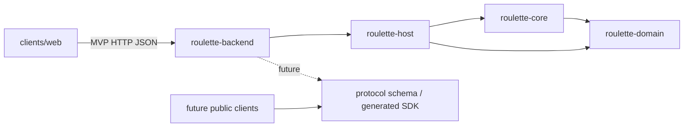

# 模块划分

## 当前 Rust 模块

| **Cargo 包** | **Rust crate 名** | **状态** | **职责** | **允许依赖** |
|---------------|-------------------|----------|----------|--------------|
| `roulette-domain` | `roulette_domain` | MVP 已实现 | 可序列化的 Tab/房间/成员/玩家 ID、EventId、EventTier、Weather、冰面地形、房间视图、命令、分类记录、事件/戏剧化事件、通知、权威状态、事件诊断树流水（CandidateTrace、EventNodeTrace、PipelineTrace，含 is_lethal 与 stalemate_rounds 标定）、地形三维属性规范契约（`TerrainLayer`：地上/地下/地上且地下/特殊，`TerrainProperties`：位置、硬度、被摧毁转换与战术说明）、随机流、Web 视图及淘汰死因（含 Collision 猛烈撞墙）。 | `serde`；不依赖运行时。 |
| `roulette-core` | `roulette_core` | MVP 已实现 | 确定性地图生成、命令校验、状态转移、显式 RNG、事件树 BFS 管线（`EventTreePipeline`）、事件定义索引库（`EventRegistry`）、多因素动态概率评估模型（`EventPool`，含 `wall_crash` 撞墙专属池、`move_intent` 纯操作位移池，以及独立的地形进入/离开生命周期事件池 `terrain_enter_*` 与 `terrain_exit_*`，支持地雷引爆/哑火、护盾装填、蹬冰碎裂化水与空地 99%~100% 高概率静默收敛）、基于硬度与位置合法性保护的弹道破坏机制（普通弹击碎硬度 1 木箱停下、穿甲重弹击碎硬度 2 墙体并贯穿前行、地下地雷免疫子弹）、环境天气与冰面相变、胜负和视图投影。 | `roulette-domain`。 |
| `roulette-host` | `roulette_host` | 本地多房间 MVP | 内存大厅、五位房间号、Tab 身份、房间密码、房主权限/转让、成员和 Bot 管理、活动超时、revision 校验及 Bot 调度。 | `roulette-core`、`roulette-domain`。 |
| `roulette-backend` | 不作为库导出 | 本地 Web MVP | 多房间 HTTP API、权威地形规则查询（`GET /api/rules/terrains`）、嵌入 Web 资源、创始人临时认证、局域网访问软开关和进程生命周期。 | `roulette-host`、`roulette-domain`、Axum、Tokio。 |

## 依赖方向

依赖不得反向：`roulette-domain` 不认识 Core、Host 或客户端；`roulette-core` 不认识网络、数据库、文件和进程；客户端不链接权威规则。

## 计划中的模块

以下名称只保留边界，不在没有实现需求时创建空工程：

| **候选模块** | **触发创建的条件** |
|--------------|--------------------|
| `roulette-protocol` | 网络 schema 和领域类型之间需要稳定转换层。 |
| `roulette-transport-websocket` | WebSocket 接入需要从应用入口中提取为复用适配器。 |
| `roulette-storage-postgres` | PostgreSQL 表结构和持久化端口冻结。 |
| `roulette-storage-sqlite` | 本地节点或离线 CLI 开始实现。 |
| `roulette-replay` | Golden Replay 与用户回放需要共用格式。 |
| `roulette-bot-api` | 外部 Bot 或 Python SDK 开始接入。 |
| `roulette-node` | 本地/LAN 权威节点进入开发。 |
| `roulette-cli` | 调试、自动化或 LLM Skill 需要稳定命令入口。 |

## 非 Rust 部分

- `clients/web`：当前为无构建的 HTML/CSS/JavaScript 本地客户端；使用 `sessionStorage` 保存 Tab ID 与所在房间。界面按品牌封面、房间大厅、模态操作、房间成员和对局棋盘分层，房间列表占据大厅主要视野，创建/加入/单人模拟/创始人设置按需弹出；桌面图例区与工具栏提供“特殊地形属性”Help 模态框，当前地图存在的特殊地形优先置顶展示并涵盖全部地形硬度、位置层级与穿甲弹破坏规则；对局时间线与左下事件检查器统一采用单列倒序排列（新增项/最新记录置于顶部）；桌面头部实时展示僵局轮数（`🔥 僵局第 X 轮`）；房间左侧栏常驻事件决策树检查器（亦保留 F2 快捷键与放大模态），实时展示权威后端 BFS 事件树、阻尼与致死动态权重评估、`[致死]` 危险徽章与结算效果，轮询机制已与模态关闭解耦。公网版框架未定。
- `protocol`：作为 Rust、TypeScript、Python 等语言共享契约的来源。
- `scripts`：允许使用适合任务的 Shell、Python、JavaScript 或 Rust，但必须记录运行环境和输入输出。

## 部署映射

- 源码应用：`apps/roulette-backend`。
- 仓库内服务器模板：`deploy/srv/apps/roulette`。
- 本机服务器影子：`/Users/akimotokaya/Documents/srv/apps/roulette`。
- 服务器实际路径：`~/srv/apps/roulette`。
- Compose 服务名：`roulette-backend`；共享 `srv_edge` 网络中的反向代理上游为 `roulette-backend:8080`。
