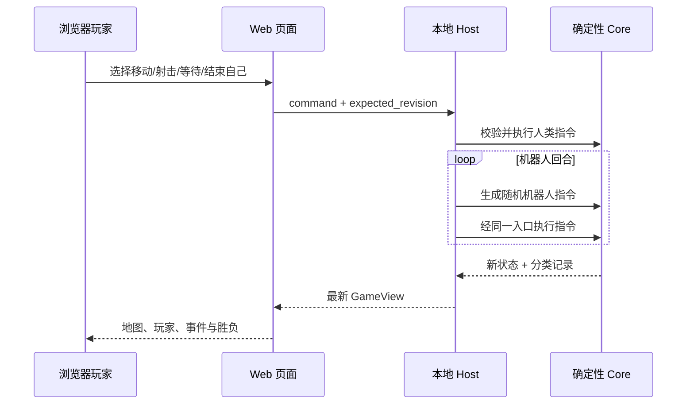

# 本地 Web MVP 规则

本文是当前可运行版本对[核心玩法规则](game-rules.md)的实现切片。两者冲突时，本文只描述本地 MVP 的实际行为；长期玩法仍以核心规则为目标，后续每次扩展都应同步更新本文或将其归档。

## 1. 对局范围

- 一局由 1 名浏览器玩家和 2～5 名本地随机机器人组成，共 3～6 名玩家。
- 人类玩家固定第一个行动，之后按创建顺序循环；出局玩家自动跳过。
- 无报名、房间、联网、重连、计时、账号或持久化。
- 全图可见。仅剩一名玩家时该玩家获胜；无人存活时平局。
- 创建对局时可输入随机种子。相同种子、相同玩家和相同人类指令序列会得到相同结果。

## 2. 地图

地图为正方形，边长是 `max(玩家数 + 2, 5)`，即 3 人局为 5×5，6 人局为 8×8。玩家只会出生在互不重叠的空地。

当前地形：

| 地形 | MVP 行为 |
|---|---|
| 空地 | 无额外效果。 |
| 墙 | 不可进入，阻挡子弹。 |
| 木箱 | 不可进入；第一发实际射出的子弹将其摧毁并停止。 |
| 水域 | 可以进入；连续两次在自己的回合结束时仍处于水中会溺水。水中的玩家不会被子弹命中。 |
| 高地 | 可以进入；站在高地射击时射程由 5 格增加为 6 格。 |
| 地雷 | 进入后触发一次致命效果，随后变为空地。 |
| 护盾拾取物 | 进入后获得一次致命伤害抵挡，随后变为空地。 |

地图按玩家数放置 `ceil(玩家数 / 3)` 面墙，并从水域、木箱、地雷、护盾拾取物、高地中依次放置与玩家数相同数量的特殊格。MVP 不保证地图连通或竞技平衡。

## 3. 可用行动

每项行动都消耗当前回合：

- `移动`：向上、下、左、右移动一格。越界、墙和木箱会阻挡移动，但仍结束回合。
- `射击`：选择一个正交方向射击。通常射程 5 格；墙和木箱阻挡子弹。
- `等待`：不移动并结束回合。
- `结束自己`：立即出局。该行动不受护盾保护。

移动到另一名玩家所在格时立即触发肘击决斗。MVP 使用确定性的五五开随机结果决定唯一幸存者；肘击不消耗护盾。

## 4. 左轮与致命效果

- 每次射击有 25% 概率空膛。
- 同一玩家连续第三次选择射击时必定空膛，随后连射计数归零。
- 移动、等待或结束自己会清空连射计数。
- 实际射出的子弹命中第一个射线上的非水中玩家时造成致命效果。
- 一次护盾可以抵挡射击、地雷或溺水；抵挡后护盾消失。肘击和主动结束不能被护盾抵挡。

## 5. 随机机器人

机器人不是特殊规则参与者，它通过与人类相同的 `PlayerCommand` 和 Core 裁定。每回合独立随机选择：

- 40%：随机方向移动；
- 40%：随机方向射击；
- 20%：等待。

浏览器提交一次人类指令后，本地 Host 会连续执行机器人的回合，直到再次轮到人类或对局结束，再返回最新视图。

## 6. 一次操作的流程

浏览器不裁定空膛、命中、死亡、地形变化或胜负，只渲染返回的结构化事实。

## 7. 全局记录

当前视图提供一条按 sequence 排序的全面记录流，而不是“行为—结果”成对列表：

- `行动`：某位玩家提交并被接受的语义命令。
- `事件`：游戏世界中发生的事实，例如移动、空膛、地形变化或玩家出局。
- `回合`：行动权和回合数推进。
- `通知`：对局开始、对局结束等系统信息，后续可扩展警告和里程碑通知。

人类和机器人选择移动、射击或等待都属于行动，不会因为操作者是机器人而归入事件。射击行动本身只记录一次；空膛、未命中、命中和地形变化才作为独立事件记录。

一个行动可能没有事件，也可能之后出现多个事件；事件未来也可由环境、定时器或事件系统独立触发。记录顺序表达先后，不自动表达因果。当前 `GameView` 返回最近 60 条记录，页面使用单列按 sequence 从小到大、自上而下显示，并自动滚动到最新位置；权威状态保留完整记录。

## 8. 暂未实现

核心规则中的普通攻击、开门、传送、冰面、事件池、物品主动使用、动态地图、LLM 叙事和复杂肘击结果暂不属于本地 MVP。公网房间、多人实时连接、数据库和协议生成也不在此版本内。
