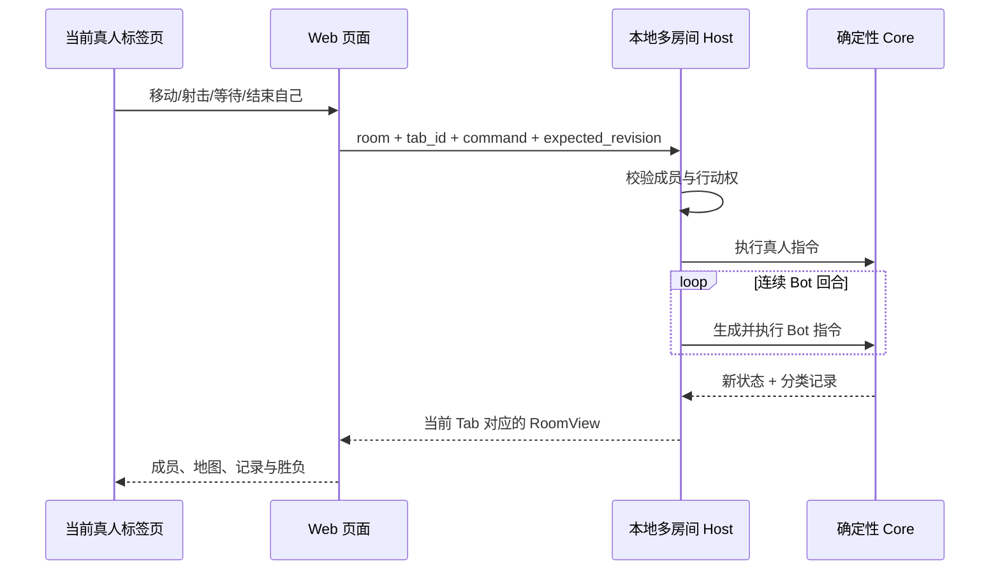

# 本地 Web MVP 规则

本文是当前可运行版本对[核心玩法规则](game-rules.md)的实现切片。它同时记录本地大厅规则；长期玩法仍以核心规则为目标。

## 1. 大厅与房间

- 每个浏览器标签页视为一名独立真人玩家。刷新或同页导航保留身份，新开或复制标签页产生新身份。
- 任何人都可以创建房间或加入正在等待的房间；同一标签页同时只能在一个房间中。
- 房间号为五位字母/数字，不区分大小写。房间最多 6 个席位。
- 创建者成为房主。房主可以设置区分大小写的加入密码；未正确提供密码的玩家不能进入。成功进入后，当前房间密码对所有成员公开显示。
- 房主可以添加或删除随机 Bot、把房主转让给另一名真人、在 3～6 个席位时开始游戏，并可主动解散房间。
- 房主退出后，房主身份交给房间内任意一名剩余真人。最后一名真人退出或失去活动状态时，房间自动解散。
- 进行中的真人退出后，其席位由 Bot 托管；若因此已无真人，房间直接解散。

本地版本没有账号、掉线重连、房间持久化或密码保密保证。成员页面每隔数秒与本地服务同步，约 15 秒无活动会被视为退出。

## 2. 对局范围

- 一局由 3～6 个房间成员组成，可混合多名真人与随机 Bot。
- 按房间席位顺序循环行动；出局玩家自动跳过。
- 全图可见。仅剩一名玩家时该玩家获胜；无人存活时平局。
- 房主开局时可输入随机种子。相同种子、相同席位顺序和相同指令序列会得到相同结果。

## 3. 地图

地图为正方形，边长是 `max(玩家数 + 2, 5)`，即 3 人局为 5×5，6 人局为 8×8。玩家只会出生在互不重叠的空地。

| 地形 | MVP 行为 |
|---|---|
| 空地 | 无额外效果。 |
| 墙 | 不可进入，阻挡子弹。 |
| 木箱 | 不可进入；第一发实际射出的子弹将其摧毁并停止。 |
| 水域 | 可以进入；连续两次在自己的回合结束时仍处于水中会溺水。水中的玩家不会被子弹命中。 |
| 高地 | 可以进入；站在高地射击时射程由 5 格增加为 6 格。 |
| 地雷 | 进入后触发一次致命效果，随后变为空地。 |
| 护盾拾取物 | 进入后获得一次致命伤害抵挡，随后变为空地。 |

地图按玩家数放置 `ceil(玩家数 / 3)` 面墙，并从水域、木箱、地雷、护盾拾取物、高地中依次放置与玩家数相同数量的特殊格。MVP 不保证地图连通或竞技平衡。

## 4. 行动、左轮与致命效果

每项行动都消耗当前回合：

- `移动`：向正交方向移动一格；越界、墙和木箱会阻挡移动，但仍结束回合。
- `射击`：选择正交方向射击。通常射程 5 格，墙和木箱阻挡子弹。
- `等待`：不移动并结束回合。
- `结束自己`：立即出局且不受护盾保护。

移动到另一名玩家所在格时立即触发五五开的肘击决斗，唯一幸存者由确定性随机流决定，肘击不消耗护盾。

- 每次射击有 25% 概率空膛。
- 同一玩家连续第三次射击必定空膛，随后连射计数归零。
- 移动、等待或结束自己会清空连射计数。
- 实际子弹命中射线上的第一个非水中玩家时造成致命效果。
- 一次护盾可抵挡射击、地雷或溺水，随后消失；不能抵挡肘击和主动结束。

## 5. 随机机器人

Bot 与真人在房间成员列表中使用同等席位展示，在对局中也使用相同 `PlayerCommand` 与 Core 裁定。房主只能在等待阶段增删 Bot。Bot 每回合独立随机选择：

- 40%：随机方向移动；
- 40%：随机方向射击；
- 20%：等待。

任一真人提交指令后，Host 会连续执行随后的 Bot 回合，直到轮到下一名真人或对局结束。机器人的选择属于“行动”，不是“事件”。

## 6. 一次操作的流程

## 7. 全局记录

对局提供按 sequence 排序的全面记录流，而不是“行为—结果”绑定列表：

- `行动`：真人或 Bot 提交并被接受的语义命令；
- `事件`：世界状态中发生的事实，如移动、空膛、地形变化或玩家出局；
- `回合`：行动权和回合数推进；
- `通知`：对局开始、结束等系统信息。

一个行动可能没有事件，也可能之后出现多个事件；事件未来也可由环境、定时器或事件系统独立触发。记录顺序表达先后，不自动表达因果。当前视图返回最近 60 条记录，页面按 sequence 从小到大、单列、自上而下显示；权威状态保留完整记录。

## 8. 暂未实现

普通攻击、开门、传送、冰面、事件池、物品主动使用、动态地图、LLM 叙事、复杂 Bot 策略和复杂肘击结果尚未实现。房间结束后原地重开、观战、断线重连、公网账号、数据库与公开协议也不在本地 MVP 内。
